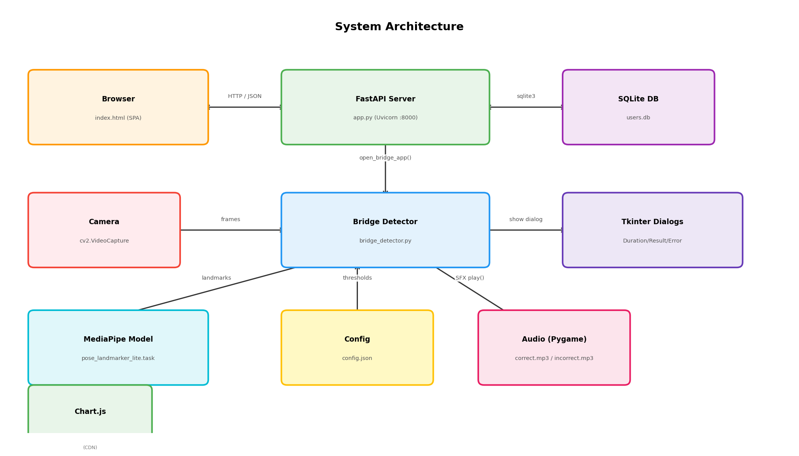
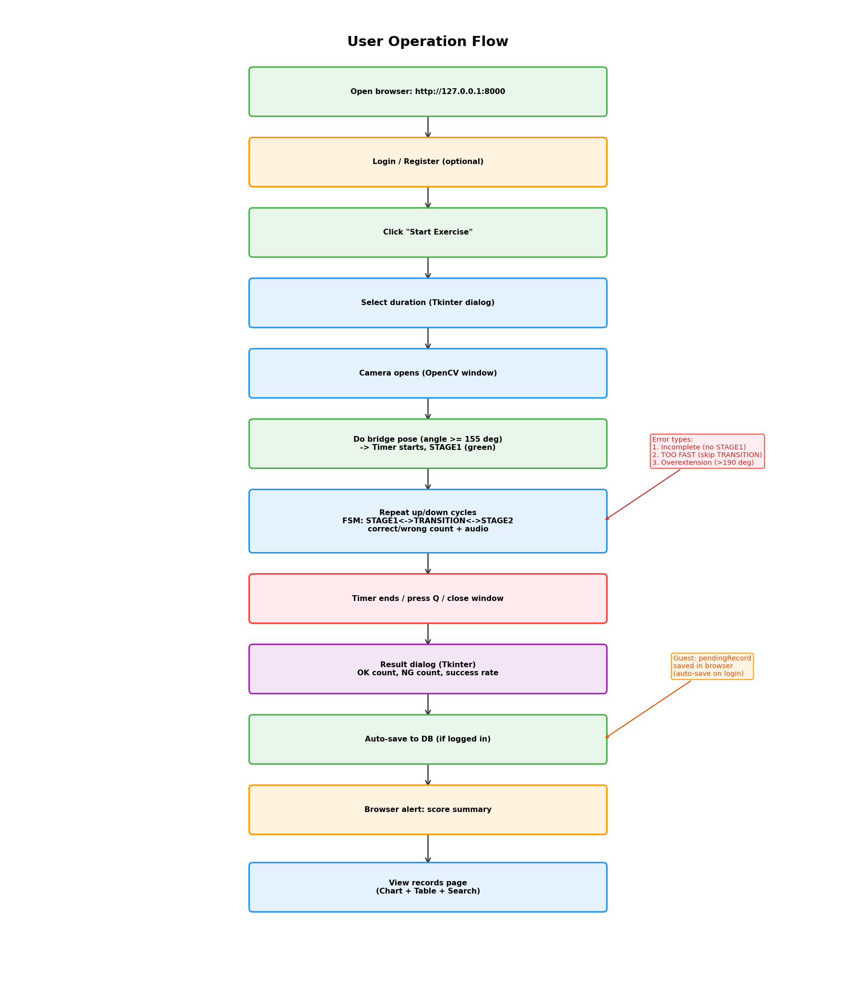
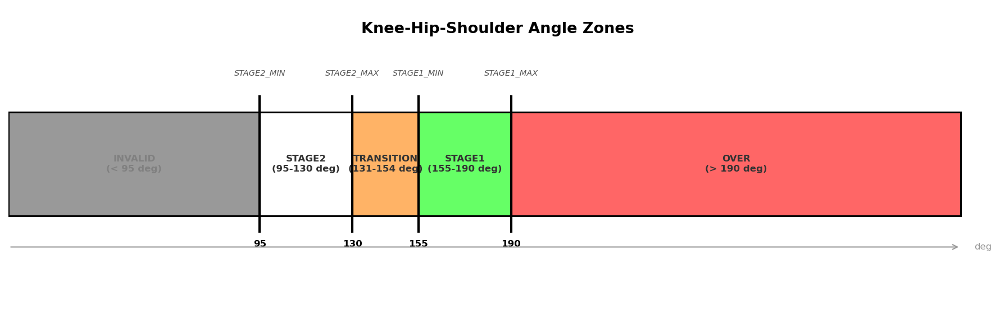
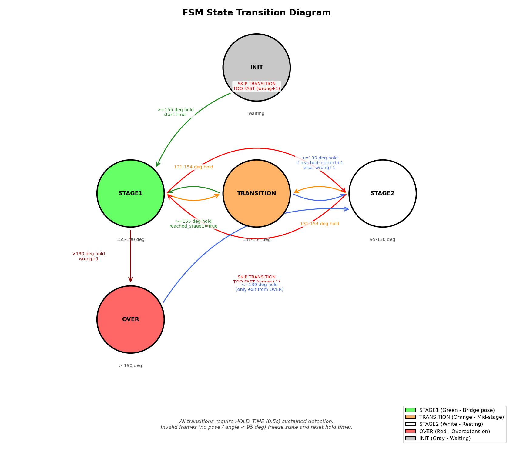

# 第 1 章 概述

## 1.1 專題動機

橋式（Bridge Exercise）是一種常見的核心肌群訓練動作，透過仰臥後抬起臀部，鍛鍊臀大肌、腿後肌群及下背部肌肉，對於改善姿勢、減緩下背痛具有顯著效果。然而在居家自主訓練的情境下，使用者往往缺乏專業教練的即時指導，容易因動作不標準而降低訓練效果，甚至造成運動傷害。

市面上雖有不少健身輔助應用程式，但多數需要手動計數或佩戴額外穿戴裝置。手動計數容易因分心而遺漏，穿戴裝置則增加了使用門檻與成本。若能透過攝影機即時辨識使用者的動作姿勢，並自動判斷橋式動作是否完成，不僅能減少人為計數的誤差，也能讓使用者專注於動作本身，提升訓練品質。

因此，本專題旨在開發一套「橋式健身輔助系統」，以攝影機搭配姿態辨識技術，即時偵測使用者的橋式動作，自動計算動作次數與訓練時間，並將成績儲存於資料庫中，供使用者日後查看與追蹤訓練進度。

## 1.2 專題目標

本專題的核心目標是實現即時姿態辨識與訓練紀錄管理，使使用者能在無人指導的情況下完成有效的橋式訓練。具體功能如下：

- 即時偵測橋式動作：透過攝影機擷取畫面，利用姿態辨識模型標記人體關鍵點，計算關節角度以判斷橋式動作階段。

- 自動計數與計時：以五狀態有限狀態機（INIT、STAGE1、TRANSITION、STAGE2、OVER）管理動作階段轉換，當使用者完成一次完整的「抬臀→過渡→放下」循環即自動累計正確次數；系統可辨識四種錯誤：動作不完整（未達 STAGE1 即放下）、動作過快（跳過 TRANSITION 階段）、以及過度伸展（臀部抬過高），各自累計錯誤次數。同時支援使用者自訂訓練時間。

- 音效回饋：動作完成時播放正確音效，動作不合格時播放錯誤音效，讓使用者在運動中無需注視螢幕也能即時得知動作是否正確。動作過快時畫面另顯示「TOO FAST」紅色警告文字。

- 防抖機制：狀態轉換需維持一段時間（預設 0.5 秒）方可生效，避免因姿勢瞬間波動導致誤判。

- 過度伸展偵測：透過向量外積計算有號角度，可偵測臀部抬過高（超過膝蓋-肩膀連線）的過度伸展情況，並自動修正面朝方向（左側/右側）對角度判定的影響。

- 帳號系統與成績存檔：提供註冊、登入功能，訓練結束後自動將正確次數、錯誤次數與訓練時長存入資料庫。

- 數據視覺化與歷史查詢：以堆疊長條圖呈現每日正確與錯誤次數，搭配成功率折線圖，並提供分頁瀏覽與進階搜尋功能，方便使用者回顧訓練歷程。

## 1.3 情境描述

本節以操作手冊的形式說明系統的完整使用情境，包含正確動作判定、各類錯誤動作的辨識機制，以及訪客模式的運作流程。

### 1.3.1 系統啟動與帳號管理

使用者開啟瀏覽器，於網址列輸入 `http://127.0.0.1:8000` 進入系統首頁。頁面中央顯示「橋式健身輔助系統」標題與一個綠色的「開始運動」按鈕，右上角顯示「訪客」字樣。

使用者點擊右上角的「登入 / 註冊」按鈕，頁面切換至帳號管理介面。初次使用者點擊「我要註冊」，輸入帳號與密碼完成註冊；已有帳號者點擊「我要登入」，輸入帳號密碼完成驗證。登入成功後，右上角顯示「你好，{使用者名稱}」，並出現「登出」和「查看所有紀錄」按鈕。

### 1.3.2 訓練啟動流程

使用者點擊「開始運動」按鈕，按鈕文字變為「視訊啟動中...」且進入不可點擊狀態。系統於伺服器端彈出深色主題的計時器選擇視窗（標題「橋式訓練計時器」），使用者透過分鐘與秒數的 Spinbox 選擇器設定訓練時長，點擊「開始訓練」確認。

攝影機畫面隨即以標題「Bridge Exercise」的 OpenCV 視窗顯示，視窗大小約為主螢幕高度的 70%，置中於主螢幕。畫面左上角的 230×310 像素資訊面板顯示：「Stage: INIT」（灰色）、「OK:0 NG:0」、「Rate:0% (0/0)」以及「Time: --:-- (do pose to start)」。使用者將攝影機架設於可拍攝全身側面的位置，仰臥彎曲膝蓋，腳掌平放地面，雙手放在身體兩側。

### 1.3.3 正確動作判定機制

本系統對「正確的橋式動作」定義為一次完整的「抬臀→過渡→放下」循環，且過程中必須經過 TRANSITION（過渡）階段。具體判定流程如下：

**正確動作（bridge_count +1，播放 correct.mp3）的條件**：

1. **STAGE2 → TRANSITION → STAGE1 → TRANSITION → STAGE2**：使用者從休息位置緩緩抬起臀部，角度從 ≤130° 經過 131°–154° 的 TRANSITION 區間到達 ≥155° 的 STAGE1 區間；隨後緩緩放下臀部，角度再次經過 TRANSITION 區間回到 ≤130° 的 STAGE2 區間。由於動作曾到達 STAGE1（`reached_stage1 = True`），且經過了 TRANSITION 過渡，系統判定為一次正確的橋式動作。

2. 每一段狀態轉換皆需持續超過 HOLD_TIME 秒（預設 0.5 秒）方可生效，此為防抖機制，確保瞬間姿勢波動不會觸發誤判。

### 1.3.4 錯誤動作判定機制

系統可辨識以下四種錯誤情境，每種皆會使 `wrong_count` 加 1 並播放 `incorrect.mp3` 音效：

**（一）動作不完整——未達 STAGE1 即放下**

使用者臀部僅抬至 TRANSITION 區間（131°–154°）便放下回到 STAGE2，全程未到達 STAGE1（≥155°）。此時 `reached_stage1 = False`，系統於 TRANSITION → STAGE2 轉換時判定為錯誤動作。

判定路徑：`STAGE2 → TRANSITION → STAGE2`（未經過 STAGE1）

**（二）動作過快——跳過 TRANSITION（下行方向）**

使用者在 STAGE1 後急速放下臀部，角度從 ≥155° 直接跌落至 ≤130°，跳過了 131°–154° 的 TRANSITION 區間。系統偵測到 STAGE1 → STAGE2 的直接轉換（未經過 TRANSITION），判定為「TOO FAST」錯誤。資訊面板同時閃爍紅色「TOO FAST」文字 2 秒。

判定路徑：`STAGE1 → STAGE2`（跳過 TRANSITION）

**（三）動作過快——跳過 TRANSITION（上行方向）**

使用者在 STAGE2 後急速抬起臀部，角度從 ≤130° 直接躍升至 ≥155°，跳過了 TRANSITION 區間。系統偵測到 STAGE2 → STAGE1 的直接轉換（未經過 TRANSITION），判定為「TOO FAST」錯誤。資訊面板閃爍紅色「TOO FAST」文字 2 秒。

判定路徑：`STAGE2 → STAGE1`（跳過 TRANSITION）

**（四）過度伸展（Overextension）**

使用者在 STAGE1 時臀部抬得過高，導致髖部高於膝蓋與肩膀的連線，角度經有號角度計算超過 STAGE1_MAX（預設 190°）。系統偵測到過度伸展，狀態轉入 OVER（紅色），`wrong_count` 加 1。OVER 狀態為鎖定狀態——使用者必須將臀部完全放下回到 STAGE2（角度 ≤130° 且持續 HOLD_TIME 秒）方可解除鎖定，重新開始下一次動作循環。

判定路徑：`STAGE1 → OVER`（角度 > 190°）

### 1.3.5 有號角度與朝向修正機制

由於 `arccos` 函式僅能回傳 0°–180° 的角度，無法區分正常的 180° 平直與超過 180° 的過度伸展。系統採用向量外積（cross product）判斷髖部是否高於膝蓋-肩膀連線：

- 計算向量 HK = Knee - Hip 與向量 HS = Shoulder - Hip 的二維外積：`cross = HK_x × HS_y - HK_y × HS_x`
- 根據使用者面朝方向（`facing_right = shoulder_x > knee_x`）決定外積正負號的意義：
  - 面朝右方時：`cross < 0` 表示過度伸展
  - 面朝左方時：`cross > 0` 表示過度伸展
- 若判定為過度伸展，將角度修正為 `360° - arccos_angle`，使 a_khs 的值超過 180°

此機制確保無論使用者面朝攝影機的左側或右側，系統皆能正確偵測過度伸展。

### 1.3.6 無效幀處理

當以下任一情況發生時，系統將該幀視為「無效」，不進行任何狀態轉換，同時重設防抖計時器：

- MediaPipe 未偵測到人體姿勢（`points = None`）
- 偵測到的膝-髖-肩角度低於 STAGE2_MIN（預設 95°），此為 MediaPipe 追蹤遺失時的異常值保護機制

無效幀期間，畫面骨架以灰色 (150, 150, 150) 顯示，FSM 狀態凍結於上一個有效狀態。

### 1.3.7 正常訓練流程示例

使用者緩緩抬起臀部，膝-髖-肩角度從約 90°（休息位置）逐漸上升。當角度持續達 155° 以上且維持 0.5 秒後，系統狀態從 INIT 轉換至 STAGE1（綠色），倒數計時同時啟動。

使用者緩緩放下臀部，角度逐漸下降。降至 131°–154° 的 TRANSITION 範圍且持續 0.5 秒後，狀態變為 TRANSITION（橘色）。角度繼續下降至 ≤130° 且持續 0.5 秒後，狀態進入 STAGE2（白色）。由於此次動作曾經到達 STAGE1（`reached_stage1 = True`），系統判定為一次正確的橋式動作，正確次數加 1，播放 `correct.mp3` 音效。資訊面板更新為「OK:1 NG:0」、「Rate:100% (1/1)」。

使用者持續重複「抬臀→放下」的完整循環。倒數計時最後 10 秒以紅色閃爍提示。時間結束後，攝影機畫面自動關閉，彈出訓練結果對話框，顯示正確次數、錯誤次數、成功率與訓練時間。

### 1.3.8 訓練結束與紀錄存檔

訓練結果對話框關閉後，瀏覽器中的「開始運動」按鈕恢復可點擊狀態。若使用者已登入且有有效紀錄（正確次數或錯誤次數大於 0），系統自動將成績存入資料庫，並彈出 alert 提示「運動結束！成績已為您自動存檔（正確 N 次，錯誤 M 次 / S 秒）。」頁面自動跳轉至紀錄頁，上方顯示每日運動統計圖表（綠色正確次數長條、紅色錯誤次數長條、藍色成功率折線），下方顯示歷史紀錄列表。

### 1.3.9 訪客模式

系統允許未登入的訪客直接使用訓練功能，流程如下：

1. 訪客點擊「開始運動」，前端彈出 alert 提示：「還未登入，我們會先紀錄起來。等待您登入後會一次送出。」

2. 訓練結束後，前端將成績暫存於 JavaScript 變數 `pendingRecord` 中（包含 duration、count、wrong），並彈出提示：「運動結束！正確 N 次，錯誤 M 次，共 S 秒。小提示：現在登入或註冊，系統會自動為您存檔喔！」

3. 訪客登入後，系統自動檢測 `pendingRecord` 不為 null，將暫存紀錄透過 `/save_record` API 送至後端存入資料庫，彈出提示：「登入成功！已將您稍早的運動紀錄 (正確N次，錯誤M次) 自動存檔！」並自動跳轉至紀錄頁。

4. 若訪客未登入即登出或關閉頁面，`pendingRecord` 將被清除，暫存紀錄遺失。

# 第 2 章 市面產品與相關知識及技術

## 2.1 市面產品

本節分析目前市面上與橋式訓練輔助相關的健身產品與應用程式，說明其功能特色與限制，並闡述本專題系統相較於這些產品的差異與改進之處。

### 2.1.1 穿戴式健身追蹤裝置

市面上常見的穿戴式健身追蹤裝置（如 Apple Watch、Fitbit、Garmin 等智慧手錶）主要透過內建的加速度計與陀螺儀偵測使用者的活動狀態。這些裝置擅長追蹤有氧運動（跑步、走路、游泳）的時間、距離、心率等指標，但對於特定肌力訓練動作（如橋式）的辨識能力有限。其主要限制包括：

- **無法判斷動作品質**：穿戴裝置僅能偵測手腕或身體的大幅度位移，無法精確判斷橋式動作中臀部的抬起角度是否達標。
- **無法區分動作階段**：無法區分使用者是處於「臀部完全抬起」或「臀部僅微微抬起」的狀態，遑論偵測過度伸展。
- **需要額外硬體**：使用者需購買並佩戴專用裝置，增加使用門檻與成本。

### 2.1.2 手機健身應用程式

手機端的健身輔助應用程式（如 Keep、Nike Training Club、Peloton 等）通常提供預錄的運動教學影片與計時器功能。部分應用程式（如 AI Coach 類型）開始嘗試透過手機攝影機進行姿態辨識，但目前主流產品仍以「跟著影片做」為主要模式。其限制包括：

- **手動計數為主**：多數應用程式需要使用者自行計算動作次數，或按下按鈕記錄完成一組。
- **即時回饋不足**：即使有攝影機偵測功能的應用程式，受限於手機算力與模型精度，通常僅能提供延遲的動作評估，無法做到逐幀即時判斷。
- **缺乏精確的角度閾值機制**：多數 AI 健身應用僅判斷「動作大致正確」或「動作不正確」，未使用精確的角度閾值與多階段狀態機來判斷動作的完整性與品質。
- **無法偵測過度伸展**：鮮少有產品能偵測使用者臀部抬得過高（過度伸展）的問題，這是橋式動作中常見但容易被忽略的錯誤。

### 2.1.3 電腦端姿態辨識健身工具

部分開源或研究性質的電腦端工具（如基於 OpenPose 或 MediaPipe 的健身輔助專案）嘗試透過攝影機進行全身姿態辨識，能較精確地計算關節角度。然而這些工具通常：

- **缺乏完整的使用者介面**：多以命令列或簡單的視窗顯示，未提供帳號管理、紀錄存檔、統計圖表等功能。
- **狀態判斷邏輯簡化**：僅以單一角度閾值判斷「動作完成/未完成」，缺乏多階段狀態機、防抖機制與過度伸展偵測。
- **缺乏音效回饋**：未提供即時的音效提示，使用者需持續注視螢幕才能知道動作是否被正確辨識。

### 2.1.4 本系統的差異化特色

相較於上述市面產品，本系統具有以下差異化特色：

| 特色 | 市面產品 | 本系統 |
|:---|:---|:---|
| 動作偵測方式 | 加速度計/手動計數/簡單影像辨識 | MediaPipe 33 keypoints + 精確角度計算 |
| 狀態判斷 | 單一閾值或無 | 五狀態 FSM + 防抖機制 + 強制過渡 |
| 錯誤動作偵測 | 無或僅判斷「不正確」 | 四種錯誤類型（不完整/過快上行/過快下行/過度伸展） |
| 過度伸展偵測 | 無 | 有號角度 + 向量外積 + 面朝方向修正 |
| 即時回饋 | 延遲/無 | 逐幀即時 + 音效 + 視覺顏色變化 |
| 紀錄管理 | 需要雲端帳號/訂閱 | 本地 SQLite + 免費無訂閱 |
| 使用門檻 | 需購買裝置/安裝 App/註冊帳號 | 僅需攝影機 + Python 環境 |
| 統計分析 | 基本 | 每日堆疊圖表 + 成功率折線 + 進階搜尋 |

## 2.2 相關知識及技術

本節介紹建構本系統所使用的技術與工具，包括姿態辨識框架、電腦視覺函式庫、後端框架、前端圖表函式庫、資料庫、桌面介面工具，以及音效播放函式庫。這些技術的介紹將為後續章節的系統架構和實作說明奠定基礎。

## 2.2.1 MediaPipe Pose

MediaPipe 是 Google 開發的一個開源跨平台框架，提供多種預訓練的機器學習解決方案，包括人臉偵測、手部追蹤、物件偵測等。其中 MediaPipe Pose 模組能夠即時標記人體 33 個 Keypoints（關鍵點），這些關鍵點對應人體結構上的特定位置，例如肩膀、髖部、膝蓋、腳踝等關節。

> 【此處需要圖片：MediaPipe 人體 33 個 Keypoints 對應圖】

本專題使用 MediaPipe 的 Pose Landmarker Lite 模型（檔案名稱為 `pose_landmarker_lite.task`），以 VIDEO 模式逐幀處理攝影機影像。VIDEO 模式與 IMAGE 模式的差異在於 VIDEO 模式會利用前後幀之間的時間連貫性來提升偵測的穩定度，每次呼叫需傳入遞增的時間戳（timestamp）。模型會回傳每個關鍵點的三維座標（x, y, z，數值範圍為 0.0 至 1.0，代表在影像中的相對位置）與可見度（visibility，0.0 至 1.0，代表該關鍵點被遮擋的程度）。

本系統在 `bridge_detector.py` 中透過以下方式初始化模型：

```python
options = PoseLandmarkerOptions(
    base_options=BaseOptions(model_asset_path="pose_landmarker_lite.task"),
    running_mode=VisionRunningMode.VIDEO,
)
landmarker = PoseLandmarker.create_from_options(options)
```

每幀影像的處理方式為：將 OpenCV 讀取的 BGR 影像轉為 RGB 格式，封裝為 `mp.Image` 物件後呼叫 `landmarker.detect_for_video(mp_image, timestamp)`，其中 timestamp 為整數，每幀遞增 1。

本系統主要使用以下四個關鍵點進行橋式動作判斷（以左側為例）：

| Keypoints 編號 | 名稱 | 用途 |
|:---:|:---:|:---|
| 11 | left_shoulder | 肩膀位置，用於計算膝-髖-肩角度的其中一端 |
| 23 | left_hip | 髖部位置，作為膝-髖-肩角度的頂點（vertex） |
| 25 | left_knee | 膝蓋位置，用於計算膝-髖-肩角度的另一端，以及腳踝-膝蓋-髖部角度 |
| 31 | left_foot_index | 腳踝（腳掌前端）位置，用於計算輔助角度（腳踝-膝蓋-髖部、膝蓋-腳踝-肩膀） |

系統會優先偵測左側身體（編號 11、23、25、31），逐一檢查這四個關鍵點的可見度（visibility）是否皆大於 0.5。若任一關鍵點可見度不足（例如該側身體被遮擋），則自動切換至右側（編號 12、24、26、32）進行偵測。若左右兩側皆無法取得足夠可見度的關鍵點，則該幀不進行角度計算，所有角度值設為 0.0。

關鍵點座標的轉換方式為：模型回傳的 x 與 y 值（0.0 至 1.0）分別乘以影像的寬度 w 與高度 h，得到像素座標 `[int(lm.x * w), int(lm.y * h)]`。

## 2.2.2 OpenCV

OpenCV（Open Source Computer Vision Library）是一個開源的電腦視覺函式庫，提供豐富的影像處理與分析功能。本系統使用 OpenCV（Python 套件名稱為 `opencv-python`，匯入名稱為 `cv2`）實現以下功能：

- 攝影機影像擷取：透過 `cv2.VideoCapture(DEVICE_ID)` 開啟攝影機，其中 DEVICE_ID 為整數（由 config.json 設定），代表攝影機裝置編號。每次呼叫 `cap.read()` 讀取一幀影像，回傳 `(success, frame)`，其中 success 為布林值，frame 為 BGR 格式的 NumPy 陣列。

- 影像格式轉換：MediaPipe 需要 RGB 格式的影像，因此使用 `cv2.cvtColor(frame, cv2.COLOR_BGR2RGB)` 將 BGR 轉為 RGB。

- 視窗建立與管理：使用 `cv2.namedWindow(WINDOW_NAME, cv2.WINDOW_NORMAL)` 建立可調整大小的視窗（`WINDOW_NORMAL` 允許使用者手動縮放）。透過 `cv2.resizeWindow()` 設定初始大小、`cv2.moveWindow()` 設定位置，使視窗置中於主螢幕。

- 骨架與輔助線繪製：
  - `cv2.circle(frame, center, radius, color, thickness)` 繪製關節圓點，半徑 10 像素，填滿（`cv2.FILLED`）。
  - `cv2.line(frame, pt1, pt2, color, thickness)` 繪製骨架連線（肩膀-髖部、髖部-膝蓋、膝蓋-腳踝、肩膀-膝蓋對角線），線寬 2-3 像素。
  - `cv2.ellipse(frame, center, axes, angle, startAngle, endAngle, color, thickness)` 繪製角度弧線。
  - `cv2.putText(frame, text, org, fontFace, fontScale, color, thickness)` 繪製角度數值標註。
  - 虛線繪製：OpenCV 沒有內建虛線功能，系統透過計算起點到終點的方向向量，以固定長度（DASH_LEN=12 像素）與間隔（GAP_LEN=7 像素）交替繪製短線段來模擬虛線效果。

- 視窗關閉偵測：使用 `cv2.getWindowProperty(WINDOW_NAME, cv2.WND_PROP_VISIBLE)` 檢查視窗是否仍然存在。此呼叫在視窗已被關閉後可能拋出 `cv2.error` 例外，因此包裹在 try/except 中。

## 2.2.3 FastAPI

FastAPI 是一個現代化的 Python Web 框架，基於 Starlette（ASGI 框架）和 Pydantic（資料驗證庫）建構，具有高效能與自動產生 API 文件的特性。本系統以 FastAPI 作為後端伺服器，搭配 Uvicorn 作為 ASGI 伺服器運行。

系統在 `app.py` 中建立 FastAPI 實例：`app = FastAPI()`。啟動方式為在 `__main__` 區塊中呼叫 `uvicorn.run(app, host="127.0.0.1", port=8000)`，伺服器監聽本地 8000 埠。

FastAPI 使用裝飾器語法定義路由，例如 `@app.get("/")` 定義 GET 請求的首頁路由，`@app.post("/login")` 定義 POST 請求的登入路由。所有路由函式皆為 async 非同步函式，接收 `Request` 物件作為參數，透過 `await request.json()` 解析前端傳來的 JSON 資料。

前端頁面的渲染使用 Jinja2 模板引擎（透過 `Jinja2Templates(directory="templates")` 設定模板資料夾路徑），以 `templates.TemplateResponse(name="index.html", request=request)` 回傳渲染後的 HTML 頁面。

## 2.2.4 SQLite

SQLite 是一個輕量級的嵌入式關聯式資料庫，不需要獨立的伺服器進程，資料庫以單一檔案（本系統為 `users.db`）儲存，適合小型應用程式使用。本系統使用 Python 內建的 `sqlite3` 模組進行操作，透過 `sqlite3.connect('users.db', timeout=5)` 建立連線（timeout=5 秒，避免在多個請求同時存取時發生鎖定逾時）。

所有資料庫操作遵循以下模式：建立連線 → 取得 cursor → 執行 SQL 語句 → commit → close。使用參數化查詢（`?` 佔位符）防止 SQL 注入攻擊。

## 2.2.5 Chart.js

Chart.js 是一個開源的 JavaScript 圖表函式庫，透過 `<canvas>` 元素在網頁上繪製互動式圖表。本系統透過 CDN 引入 Chart.js：`<script src="https://cdn.jsdelivr.net/npm/chart.js"></script>`。

本系統使用 Chart.js 繪製「每日運動紀錄複合圖表」，同時包含：

- 堆疊長條圖（Stacked Bar Chart）：以綠色長條顯示每日正確次數，紅色長條堆疊於其上顯示每日錯誤次數，共用左側 Y 軸（標題「次數」）。兩組長條使用相同的 `stack: 'counts'` 屬性進行堆疊。

- 折線圖（Line Chart）：以藍色折線顯示每日成功率，使用右側 Y 軸（標題「成功率 (%)」，範圍 0–100%，刻度顯示百分號）。折線使用 `tension: 0.3` 呈現平滑曲線，`spanGaps: true` 使空值日期自動跳過。

圖表建立時會先銷毀既有實例（`dailyChartInstance.destroy()`），再建立新的 Chart 物件，避免記憶體洩漏。

## 2.2.6 Tkinter

Tkinter 是 Python 的標準 GUI（圖形使用者介面）工具組，無須額外安裝即可使用（隨 Python 發行版附帶）。本系統使用 Tkinter 建立三種桌面對話框，所有對話框皆採用統一的深色主題（Catppuccin Mocha 配色）：

- 背景色 BG = "#1e1e2e"（深藍黑色）
- 強調色 ACCENT = "#89b4fa"（粉藍色）
- 按鈕背景 BTN_BG = "#313244"（深灰色）
- 按鈕懸停 BTN_HOV = "#45475a"（淺灰色）
- 標題色 TITLE_FG = "#cba6f7"（淡紫色）
- 文字色 TEXT_FG = "#cdd6f4"（淡灰白色）

三種對話框分別為：

1. 訓練時間選擇器（`ask_duration` 函式）：標題「橋式訓練計時器」，包含分鐘 Spinbox（0–59）與秒數 Spinbox（0–50，增量 10），以及「開始訓練」按鈕。底部提示「計時從第一個橋式動作開始」。

2. 訓練結果對話框（`show_result_dialog` 函式）：標題「訓練完成！」，大字綠色數字顯示正確次數，紅色文字顯示錯誤次數，白色文字顯示成功率百分比，灰色文字顯示訓練時間，以及「關閉 / Close」按鈕。

3. 錯誤提示對話框（`show_error_dialog` 函式）：標題「訓練未完成」（紅/粉色），訊息「系統發生錯誤或您已手動關閉視窗。」，以及「確定」按鈕。

所有 Tkinter 視窗均使用以下置中流程：`root.withdraw()`（先隱藏）→ 呼叫 `get_primary_monitor()` 取得主螢幕位置與尺寸 → `root.update_idletasks()` 計算視窗大小 → 計算置中座標 → `root.geometry(f"{ww}x{wh}+{cx}+{cy}")` 設定位置 → `root.deiconify()`（顯示）。此流程避免視窗先出現在預設位置再跳至中央的閃爍現象。

`get_primary_monitor()` 函式的實作方式為：透過 `subprocess.run(['xrandr'])` 執行系統指令，從輸出中找到包含 `connected primary` 的行，以正規表達式 `(\d+)x(\d+)\+(\d+)\+(\d+)` 解析出主螢幕的寬度、高度與偏移量（x, y），回傳 `(offset_x, offset_y, width, height)` 元組。若 xrandr 執行失敗或找不到主螢幕，回傳 None，系統退回使用 Tkinter 的 `winfo_screenwidth()` / `winfo_screenheight()`（此方法在多螢幕環境下會回傳整個虛擬桌面的尺寸，因此僅作為備援）。

## 2.2.7 Pygame

Pygame 是一個跨平台的 Python 多媒體函式庫，常用於遊戲開發，但也適合處理音效播放等多媒體任務。本系統使用 Pygame 的 `mixer` 模組播放音效回饋。

初始化方式為在 `bridge_detector.py` 的模組層級呼叫 `pygame.mixer.init()`，並載入兩個音效物件：

```python
SFX_CORRECT   = pygame.mixer.Sound(os.path.join(_base_dir, "audio", "correct.mp3"))
SFX_INCORRECT = pygame.mixer.Sound(os.path.join(_base_dir, "audio", "incorrect.mp3"))
```

使用 `os.path.join` 搭配 `os.path.dirname(os.path.abspath(__file__))` 取得腳本所在目錄的絕對路徑，確保不論從哪個工作目錄執行程式都能正確找到音效檔案。

播放音效的方式為呼叫 `SFX_CORRECT.play()` 或 `SFX_INCORRECT.play()`。`play()` 為非阻塞呼叫，音效會在背景播放，不會暫停主程式的執行。

音效檔案存放於專案的 `audio/` 資料夾中：
- `audio/correct.mp3`：正確動作音效，檔案大小約 43 KB。
- `audio/incorrect.mp3`：錯誤動作音效，檔案大小約 34 KB。
- `audio/legacy/`：存放舊版本的音效檔案（目前未使用）。

# 第 3 章 系統簡介

本章說明系統的整體架構與運作流程，呈現系統如何實現橋式動作偵測、自動計數與紀錄管理功能。除了介紹系統的各個組成部分及其功能之外，也會說明系統各模組之間如何互動以達成訓練輔助之目的。

## 3.1 系統架構

本系統採用前後端整合架構，所有元件運行於同一台電腦上。系統包含 Web 伺服器、姿態偵測模組、資料庫及前端頁面四個主要部分。



### 3.1.1 Web 伺服器（app.py — FastAPI）

Web 伺服器為系統的核心樞紐，負責接收前端請求並協調各模組運作。程式檔案為 `app.py`，使用 FastAPI 框架搭配 Uvicorn 伺服器運行於 `http://127.0.0.1:8000`。主要功能包括：

- 頁面服務：使用 Jinja2 模板引擎渲染 `templates/index.html` 頁面，回應瀏覽器對首頁的 GET 請求。

- 自動初始化：伺服器啟動時透過 `@app.on_event("startup")` 裝飾器自動呼叫 `init_all_tables()` 函式，確保 `users` 與 `records` 資料表已建立，避免因忘記手動執行初始化腳本而導致系統錯誤。

- 帳號管理：處理使用者的註冊（`POST /register`）、登入（`POST /login`）、登出（`POST /logout`）請求。登入成功後透過 `response.set_cookie(key="username", value=u_input, max_age=30*24*3600, httponly=False)` 設定 Cookie，有效期 30 天（2,592,000 秒），`httponly=False` 允許前端 JavaScript 讀取。提供 `GET /me` 端點讓前端檢查當前登入狀態。

- 偵測啟動：接收前端的「開始運動」請求（`POST /open_app`）後，呼叫 `bridge_detector.py` 中的 `open_bridge_app()` 函式。此函式為同步阻塞呼叫——在使用者完成訓練或關閉視窗之前，伺服器不會回應此請求。訓練結束後，函式回傳 `(countdown, bridge_count, wrong_count)` 三個值。

- 自動存檔：`/open_app` 端點在取得偵測結果後，若使用者已登入（username 不為空字串）且正確次數或錯誤次數大於 0，則自動將紀錄寫入 `records` 資料表。

- 補存機制：提供 `POST /save_record` 端點，供訪客登入後補存先前的訓練紀錄。此端點接收 JSON 格式的 `{username, correct, error, duration}`，在 `correct > 0 or error > 0` 時寫入資料庫。

- 統計查詢：提供三個 GET 端點用於紀錄查詢——每日統計（`/get_daily_stats/{username}`）、全部紀錄分頁（`/get_all_records/{username}`）、進階搜尋（`/search_records/{username}`）。

### 3.1.2 姿態偵測模組（bridge_detector.py）

姿態偵測模組是系統的核心運算單元，檔案為 `bridge_detector.py`。此模組在被 `app.py` 匯入時（`from bridge_detector import open_bridge_app`）即執行模組層級的初始化工作：

1. 讀取 `config.json` 設定檔，載入 DEVICE_ID、STAGE1_MIN、STAGE1_MAX、STAGE2_MAX、HOLD_TIME 五個參數。
2. 初始化 Pygame mixer 並載入 `correct.mp3` 與 `incorrect.mp3` 兩個音效。
3. 定義 `State` 列舉類別（INIT、STAGE1、TRANSITION、STAGE2）。
4. 定義 `calculate_angle()`、`detect_bridge()`、`get_primary_monitor()` 等輔助函式。
5. 定義各狀態對應的顏色字典 `STATE_COLOR`。

當 `open_bridge_app()` 被呼叫時，模組會：載入 MediaPipe 模型 → 彈出時間選擇器 → 開啟攝影機 → 進入主迴圈進行即時偵測 → 訓練結束後彈出結果/錯誤對話框 → 回傳 `(duration, correct_count, wrong_count)` 給呼叫者。

### 3.1.3 資料庫（users.db — SQLite）

資料庫以單一檔案 `users.db` 儲存所有資料，初始化腳本為 `init_record.py`。資料庫包含兩張資料表：

- `users` 表：欄位為 `id`（自動遞增主鍵）、`username`（唯一、不可為空）、`password`（不可為空）。用於存放會員帳號資訊。

- `records` 表：欄位為 `id`（自動遞增主鍵）、`username`（不可為空）、`correct_count`（整數）、`error_count`（整數）、`duration_seconds`（整數）、`timestamp`（預設為 `CURRENT_TIMESTAMP`，即 UTC 時間）。用於存放每次訓練的成績資料。

伺服器啟動時會自動呼叫 `init_all_tables()` 建立資料表（使用 `CREATE TABLE IF NOT EXISTS`），確保資料表存在但不覆蓋既有資料。

### 3.1.4 前端頁面（templates/index.html）

前端為單頁式 HTML 網頁應用（SPA），所有頁面切換透過 JavaScript 控制 DOM 元素的 `display` 屬性實現，不涉及頁面跳轉。前端使用原生 JavaScript（無任何框架如 React 或 Vue），透過 Fetch API 與後端通訊，搭配 Chart.js 繪製圖表。

頁面包含三個主要區塊（任一時間僅顯示其中一個）：

- 主頁（`div#main_content`）：包含「橋式健身輔助系統」標題與「開始運動」按鈕。右上角包含使用者問候語（`span#user_greeting`，預設顯示「訪客」）、「登入 / 註冊」按鈕（`button#auth_btn`）、「登出」按鈕（`button#logout_btn`，預設隱藏）、「查看所有紀錄」按鈕（`button#show_all_records_btn`，預設隱藏）。

- 帳號管理頁（`div#auth_page`）：包含「我要註冊」與「我要登入」兩個按鈕，以及一個動態表單容器（`div#form_container`），點擊按鈕後透過 JavaScript 動態產生對應的帳號/密碼輸入表單。

- 紀錄頁（`div#records_page`）：上半部為圖表區塊（`div.chart-section`），包含天數篩選輸入框與 `<canvas>` 元素；下半部為表格區塊（`div.table-section`），包含搜尋列、紀錄表格與分頁控制按鈕。

頁面載入時會自動呼叫 `restoreSession()` 函式，向 `GET /me` 發送請求檢查 Cookie 中是否有有效的 username，若有則自動恢復登入狀態（更新問候語、顯示/隱藏相關按鈕）。

## 3.2 系統流程

### 3.2.1 使用者操作流程

使用者的完整操作流程如下：

1. 開啟瀏覽器，在網址列輸入 `http://127.0.0.1:8000`，按下 Enter。瀏覽器向 FastAPI 伺服器發送 `GET /` 請求，伺服器透過 Jinja2 渲染 `index.html` 並回傳。頁面載入後，JavaScript 自動執行 `restoreSession()`，向 `GET /me` 發送請求。若 Cookie 中有 username 且有效，則恢復登入狀態；否則維持訪客模式。

2. （選擇性）點擊右上角的「登入 / 註冊」按鈕，頁面切換至帳號管理頁。使用者可選擇註冊（輸入帳號密碼 → 前端發送 `POST /register` → 若帳號未重複則註冊成功，自動切換至登入表單）或登入（輸入帳號密碼 → 前端發送 `POST /login` → 驗證通過後伺服器回傳 Set-Cookie 標頭，前端更新 UI 狀態 → 頁面返回主頁）。

3. 點擊「開始運動」按鈕。前端 JavaScript 將按鈕文字改為「視訊啟動中...」並設為 disabled 防止重複點擊。若為訪客模式，先彈出 alert 提示紀錄暫存機制。隨後前端發送 `POST /open_app`，請求 body 為 `{"username": "當前使用者名稱或空字串"}`。

4. 後端收到請求後呼叫 `open_bridge_app()`。此函式首先彈出 Tkinter 時間選擇器對話框（置中於主螢幕）。使用者透過 Spinbox 選擇分鐘與秒數後點擊「開始訓練」。若使用者直接關閉選擇器視窗，程式呼叫 `sys.exit(0)` 結束。

5. 時間選擇器關閉後，系統開啟攝影機（`cv2.VideoCapture(DEVICE_ID)`），讀取一幀取得攝影機解析度，計算視窗大小（以主螢幕高度 70% 為基準，按攝影機長寬比計算寬度；若寬度超過螢幕 90% 則改以寬度為基準），建立 OpenCV 視窗並置中顯示。

6. 進入主迴圈。攝影機畫面即時顯示，等待使用者做出第一個橋式動作（膝-髖-肩角度持續 ≥ STAGE1_MIN 達 HOLD_TIME 秒）後啟動倒數計時。使用者重複「抬臀→放下」的動作，系統透過有限狀態機（含防抖機制）自動判斷正確與錯誤次數，並在每次狀態轉換時播放對應音效。

7. 倒數結束或使用者手動關閉（按 q 鍵或點擊視窗 X 按鈕）後，攝影機釋放、OpenCV 視窗關閉，彈出結果或錯誤對話框（Tkinter，置中於主螢幕）。

8. 結果對話框關閉後，`open_bridge_app()` 回傳 `(duration, correct_count, wrong_count)`。後端檢查使用者是否已登入且有有效紀錄，若是則寫入資料庫。最終向前端回傳 JSON 回應 `{"status": "success", "duration": N, "correct_count": N, "error_count": N}`。

9. 前端收到回應後恢復按鈕狀態。若正確與錯誤次數皆為 0，彈出「沒有完成任何橋式動作」的提示；若為已登入使用者，彈出成績已存檔提示並自動跳轉至紀錄頁；若為訪客，將成績暫存至 `pendingRecord` 變數並提示登入以保存紀錄。

10. 使用者可在紀錄頁查看每日運動統計圖表（可調整顯示天數 1–50 天）與歷史紀錄列表（支援日期範圍與運動時長篩選、分頁瀏覽），點擊「返回主頁」回到主頁。



### 3.2.2 橋式動作辨識

系統透過計算膝-髖-肩（Knee-Hip-Shoulder, KHS）角度來判斷橋式動作的階段。以髖部（Hip）為頂點，計算膝蓋（Knee）與肩膀（Shoulder）之間形成的角度。



角度計算公式如下：

給定三個二維座標點 A（Knee）、B（Hip）、C（Shoulder），以 B 為頂點的角度 θ 計算步驟為：

1. 計算向量 BA = A - B 和向量 BC = C - B
2. 計算向量內積 BA · BC = BA_x × BC_x + BA_y × BC_y
3. 計算向量長度 |BA| 和 |BC|
4. 計算 cos(θ) = (BA · BC) / (|BA| × |BC| + 1e-6)，其中 1e-6 為避免除以零的微小值
5. 以 np.clip 將 cos(θ) 限制在 [-1.0, 1.0] 範圍內，避免浮點數精度問題導致 arccos 回傳 NaN
6. θ = arccos(cos(θ))，並轉換為角度制（乘以 180/π）

$$\theta = \arccos\left(\frac{\vec{BA} \cdot \vec{BC}}{|\vec{BA}| \times |\vec{BC}|}\right)$$

在程式碼中的實作為 `calculate_angle(a, b, c)` 函式：

```python
def calculate_angle(a, b, c):
    a, b, c = np.array(a), np.array(b), np.array(c)
    ba = a - b
    bc = c - b
    cos_val = np.dot(ba, bc) / (np.linalg.norm(ba) * np.linalg.norm(bc) + 1e-6)
    return float(np.degrees(np.arccos(np.clip(cos_val, -1.0, 1.0))))
```

系統實際計算三個角度：

- **a_khs**（Knee-Hip-Shoulder）：主要的橋式判斷角度。`calculate_angle(knee, hip, shoulder)`，以髖部為頂點。當使用者臀部完全抬起時，膝蓋、髖部、肩膀接近一條直線，角度接近 180°；當臀部放下時，髖部向下彎曲，角度變小。

- **a_fkh**（Ankle-Knee-Hip）：腿部彎曲的參考角度。`calculate_angle(ankle, knee, hip)`，以膝蓋為頂點。

- **a_kfs**（Knee-Ankle-Shoulder）：腳踝至肩膀方向的參考角度。`calculate_angle(knee, ankle, shoulder)`，以腳踝為頂點。此角度在攝影機畫面上以輔助虛線（從腳踝到肩膀的金黃色虛線）與弧線可視化。

根據 a_khs 的數值（經有號角度修正後，範圍可超過 180°），`detect_bridge()` 函式判斷動作分為以下階段：

| 階段 | 角度範圍 | 判斷條件 | 顏色（BGR） | 說明 |
|:---:|:---:|:---:|:---:|:---|
| OVER（過度伸展） | > 190° | `a_khs > STAGE1_MAX` | (0, 0, 255) 紅色 | 臀部抬過高，髖部超過膝-肩連線 |
| STAGE1（橋式完成） | 155°–190° | `STAGE1_MIN <= a_khs <= STAGE1_MAX` | (0, 255, 0) 綠色 | 臀部抬起，身體呈接近一直線 |
| TRANSITION（過渡） | 131°–154° | `STAGE2_MAX < a_khs < STAGE1_MIN` | (0, 165, 255) 橘色 | 臀部正在抬起或放下的中間狀態 |
| STAGE2（休息） | 95°–130° | `STAGE2_MIN <= a_khs <= STAGE2_MAX` | (255, 255, 255) 白色 | 臀部放下，回到休息位置 |
| 無效（Invalid） | < 95° 或無姿勢 | `a_khs < STAGE2_MIN` 或 `points is None` | (150, 150, 150) 灰色 | 追蹤遺失或異常角度，狀態凍結 |

上述角度範圍的數值由 `config.json` 中的 `STAGE1_MIN`（155）、`STAGE1_MAX`（190）、`STAGE2_MAX`（130）、`STAGE2_MIN`（95）四個參數決定。TRANSITION 的範圍為 STAGE2_MAX 與 STAGE1_MIN 之間的區間（不含端點），即 131° 至 154°，無需額外設定。

**有號角度修正**：由於 `arccos` 回傳的角度始終在 0°–180° 之間，無法直接表示超過 180° 的過度伸展情況。系統透過向量外積（cross product）判斷髖部是否高於膝蓋-肩膀連線，若是則將角度修正為 `360° - arccos_angle`。外積符號的判斷依據使用者面朝方向自動調整（`facing_right = shoulder_x > knee_x`），確保左右朝向皆能正確偵測。

### 3.2.3 狀態機轉換

系統使用有限狀態機（Finite State Machine, FSM）管理動作階段的轉換，確保計數邏輯的正確性。狀態機以 Python 的 `Enum` 類別定義，包含五個狀態：

```python
class State(Enum):
    INIT       = auto()   # 等待第一個橋式動作
    STAGE1     = auto()   # 橋式完成（臀部抬起，角度 155°–190°）
    TRANSITION = auto()   # 過渡階段（臀部部分抬起，角度 131°–154°）
    STAGE2     = auto()   # 休息（臀部放下，角度 95°–130°）
    OVER       = auto()   # 過度伸展（角度 > 190°）
```

> （見下方 FSM 狀態轉換圖）



系統維護以下狀態變數：

| 變數名稱 | 型別 | 初始值 | 用途 |
|:---:|:---:|:---:|:---|
| `state` | State | State.INIT | 當前 FSM 狀態 |
| `bridge_count` | int | 0 | 正確橋式次數 |
| `wrong_count` | int | 0 | 錯誤動作次數 |
| `timer_started` | bool | False | 計時器是否已啟動 |
| `timer_start_time` | float | 0.0 | 計時器啟動的 wall-clock 時間（`time.time()`） |
| `finished` | bool | False | 倒數是否已結束 |
| `reached_stage1` | bool | False | 本次循環中是否曾到達 STAGE1 |
| `pending_state` | State/None | None | 防抖機制中等待確認的目標狀態 |
| `pending_since` | float | 0.0 | 防抖機制中目標狀態開始被偵測到的時間 |
| `last_event` | str/None | None | 最近一次事件標籤（如 "TOO FAST"），用於面板閃爍顯示 |
| `last_event_time` | float | 0.0 | `last_event` 被設定的時間戳，顯示超過 2 秒後自動清除 |

各狀態的轉換規則如下：

**無效幀處理（優先於所有狀態轉換）**：當 `detected = None`（無姿勢或角度 < STAGE2_MIN）時，清除 `pending_state = None`，FSM 狀態凍結不變。此機制防止 MediaPipe 追蹤暫時遺失時觸發錯誤的狀態轉換。

**INIT → STAGE1**：當角度偵測結果為 STAGE1 且持續達到 HOLD_TIME 秒。轉換時設定 `reached_stage1 = True`，若計時器尚未啟動則同時啟動計時器（`timer_started = True`，記錄 `timer_start_time = now`）。若角度偵測結果不為 STAGE1，清除 pending_state。INIT 狀態僅接受 STAGE1 作為轉換目標。

**STAGE1 → TRANSITION**（正常下行）：當角度偵測結果為 TRANSITION 且持續達到 HOLD_TIME 秒。此為正常的動作下行路徑。

**STAGE1 → STAGE2**（跳過 TRANSITION，TOO FAST）：當角度偵測結果直接為 STAGE2（跳過 TRANSITION）且持續達到 HOLD_TIME 秒。轉換時 `wrong_count += 1`，播放 `SFX_INCORRECT.play()`，設定 `last_event = "TOO FAST"`，重設 `reached_stage1 = False`。

**STAGE1 → OVER**（過度伸展）：當角度偵測結果為 OVER 且持續達到 HOLD_TIME 秒。轉換時 `wrong_count += 1`，播放 `SFX_INCORRECT.play()`，重設 `reached_stage1 = False`。

**TRANSITION → STAGE1**（上行確認）：當角度偵測結果為 STAGE1 且持續達到 HOLD_TIME 秒。轉換時設定 `reached_stage1 = True`。

**TRANSITION → STAGE2**（下行完成）：當角度偵測結果為 STAGE2 且持續達到 HOLD_TIME 秒。轉換時檢查 `reached_stage1`：
- 若為 True（本次循環曾到達 STAGE1）：`bridge_count += 1`，播放 `SFX_CORRECT.play()`。此為正確的橋式動作。
- 若為 False（本次循環未曾到達 STAGE1，即使用者臀部未充分抬起即放下）：`wrong_count += 1`，播放 `SFX_INCORRECT.play()`。此為不完整的動作。
- 兩種情況皆重設 `reached_stage1 = False`。

**STAGE2 → TRANSITION**（正常上行）：當角度偵測結果為 TRANSITION 且持續達到 HOLD_TIME 秒。開始新的動作循環。

**STAGE2 → STAGE1**（跳過 TRANSITION，TOO FAST）：當角度偵測結果直接為 STAGE1（跳過 TRANSITION）且持續達到 HOLD_TIME 秒。轉換時 `wrong_count += 1`，播放 `SFX_INCORRECT.play()`，設定 `last_event = "TOO FAST"`，同時設定 `reached_stage1 = True`（因為確實到達了 STAGE1）。

**OVER → STAGE2**（唯一出口）：OVER 為鎖定狀態，僅當角度偵測結果為 STAGE2 且持續達到 HOLD_TIME 秒時方可離開。轉換時重設 `reached_stage1 = False`。OVER 狀態不接受任何其他轉換目標——即使角度回到 STAGE1 或 TRANSITION 範圍也不會觸發轉換，使用者必須將臀部完全放下。

**TRANSITION 為強制經過的階段**：系統要求所有上行（STAGE2→STAGE1）與下行（STAGE1→STAGE2）路徑皆必須經過 TRANSITION 階段。若角度變化過快跳過了 TRANSITION，系統判定為「TOO FAST」錯誤。此設計的目的是確保使用者以適當的速度進行動作，避免靠慣性甩動完成橋式。

**防抖機制（Hold Time）的詳細運作方式**：

每一幀中，系統根據當前角度值判斷「偵測到的狀態」（detected）。接著檢查 detected 是否與 pending_state 相同：

- 若 detected 為目標轉換方向且 `pending_state != detected`：設定 `pending_state = detected`，記錄 `pending_since = now`。這代表剛開始偵測到新狀態，開始計時。
- 若 detected 為目標轉換方向且 `pending_state == detected`：檢查 `now - pending_since >= HOLD_TIME`。若是，則確認轉換，執行狀態切換邏輯並清除 `pending_state = None`。
- 若 detected 不為目標轉換方向：清除 `pending_state = None`。這代表使用者的姿勢在 HOLD_TIME 內回到了原本的狀態，轉換取消。
- 若 detected 為 None（無效幀）：清除 `pending_state = None`。防止追蹤遺失後誤觸轉換。

此機制的效果是：使用者的姿勢必須穩定在新狀態至少 HOLD_TIME 秒（預設 0.5 秒）才會被確認轉換。瞬間的抖動或晃動（持續時間 < HOLD_TIME）不會觸發狀態轉換。HOLD_TIME 的值可透過 `config.json` 調整。

當 `finished` 為 True（倒數已結束）時，FSM 不再執行任何狀態轉換，畫面維持最後的狀態直到迴圈結束。

### 3.2.4 訪客機制

系統允許未登入的訪客直接使用訓練功能。訪客機制的完整流程如下：

1. 訪客點擊「開始運動」按鈕，前端檢查 `currentUser === ""`，若為空字串則彈出 alert：「還未登入，我們會先紀錄起來。等待您登入後會一次送出。」

2. 前端發送 `POST /open_app`，body 為 `{"username": ""}`。後端照常啟動偵測程式。

3. 偵測結束後，後端檢查 `u`（username）為空字串，因此不執行資料庫寫入。但仍回傳 `{"status": "success", "duration": N, "correct_count": N, "error_count": N}` 給前端。

4. 前端收到回應後，若 `correct_count > 0 || error_count > 0`，將成績暫存至 JavaScript 變數：`pendingRecord = { duration: N, count: N, wrong: M }`。彈出 alert：「運動結束！正確 N 次，錯誤 M 次，共 S 秒。小提示：現在登入或註冊，系統會自動為您存檔喔！」

5. 若訪客隨後登入（在 `handleLogin()` 函式中），登入成功後系統檢查 `pendingRecord !== null`，若存在則自動發送 `POST /save_record`，body 為 `{"username": "...", "correct": N, "error": M, "duration": S}`。成功後彈出 alert：「登入成功！已將您稍早的運動紀錄 (正確N次，錯誤M次) 自動存檔！」並清除 `pendingRecord = null`，然後自動跳轉至紀錄頁。

6. 若訪客登出（點擊「登出」按鈕），`pendingRecord` 會被清除（`pendingRecord = null`），暫存的紀錄將遺失。

# 第 4 章 系統實作

本章將說明本系統的建置與實作過程，包括各模組的程式碼結構與功能概述。系統由後端伺服器、姿態偵測核心、資料庫初始化、前端頁面四個部分組成，以下分別介紹各部分的實作細節。

## 4.1 專案檔案結構

```
bridge_pose_server/
├── app.py                     # FastAPI 主程式，定義所有 API 端點
├── bridge_detector.py         # 姿態偵測核心模組（攝影機、MediaPipe、FSM、音效、UI 對話框）
├── init_record.py             # 資料庫初始化（建立 users 與 records 資料表）
├── config.json                # 設定檔（攝影機編號、角度閾值、防抖時間）
├── pose_landmarker_lite.task   # MediaPipe Pose Landmarker Lite 模型檔案（約 5.7 MB）
├── audio/
│   ├── correct.mp3            # 動作正確音效（約 43 KB）
│   ├── incorrect.mp3          # 動作錯誤音效（約 34 KB）
│   └── legacy/                # 舊版音效檔案（未使用）
├── templates/
│   └── index.html             # 前端單頁式網頁（HTML + CSS + JavaScript）
├── users.db                   # SQLite 資料庫檔案（首次啟動自動建立）
├── main.py                    # 舊版伺服器主程式（已不使用，保留供參考）
├── users_db.py                # 舊版資料庫初始化腳本（僅建立 users 表）
├── add_fake_record.py         # 測試用：建立 test/123 帳號並產生 7 天隨機紀錄
├── add_test_data.py           # 測試用：新增指定的測試紀錄
└── check_db.py                # 測試用：列印 users 資料表中的所有帳號資料
```

各檔案的用途說明：

- `app.py`：系統的主程式，定義所有 API 路由與商業邏輯，啟動伺服器。
- `bridge_detector.py`：姿態偵測的核心邏輯，包含攝影機控制、MediaPipe 模型呼叫、角度計算、FSM 狀態管理、骨架繪製、資訊面板、音效播放、三個 Tkinter 對話框。
- `init_record.py`：提供 `init_all_tables()` 函式，建立 `users` 與 `records` 兩張資料表。可獨立執行（`python init_record.py`）或由 app.py 在啟動時自動呼叫。
- `config.json`：集中管理系統的可調整參數，修改後需重啟伺服器生效。
- `pose_landmarker_lite.task`：MediaPipe 提供的預訓練姿態辨識模型，直接放在專案根目錄中供 bridge_detector.py 載入。
- `add_fake_record.py`：測試工具，建立帳號 `test`（密碼 `123`）並產生 7 天的隨機訓練紀錄（每天 1–3 筆，正確 3–20 次，錯誤 0–8 次，時長 60–300 秒），方便測試圖表與紀錄列表的顯示效果。
- `check_db.py`：測試工具，列印 users 資料表中的所有帳號與密碼，用於確認資料庫狀態。

## 4.2 設定檔（config.json）

系統的可調整參數集中於 `config.json`，位於專案根目錄。`bridge_detector.py` 在模組載入時即讀取此檔案：

```python
_config_path = os.path.join(os.path.dirname(os.path.abspath(__file__)), "config.json")
with open(_config_path, "r") as _f:
    CONFIG = json.load(_f)
```

使用 `os.path.dirname(os.path.abspath(__file__))` 確保無論從哪個工作目錄執行程式，都能正確找到與 `bridge_detector.py` 同目錄下的 `config.json`。

設定檔內容與各參數說明如下：

```json
{
    "DEVICE_ID": 0,
    "STAGE1_MIN": 155,
    "STAGE1_MAX": 190,
    "STAGE2_MAX": 130,
    "STAGE2_MIN": 95,
    "HOLD_TIME": 0.5
}
```

| 參數 | 型別 | 預設值 | 說明 |
|:---:|:---:|:---:|:---|
| DEVICE_ID | 整數 | 0 | 攝影機裝置編號。作業系統為每個攝影機裝置分配一個編號，通常 0 為內建鏡頭，1、2 為外接 USB 攝影機。可透過 `ls /dev/video*`（Linux）查看可用裝置。若開啟攝影機失敗，嘗試改為 1 或 2。 |
| STAGE1_MIN | 整數 | 155 | STAGE1（橋式完成）的最小膝-髖-肩角度（單位：度）。角度 ≥ 此值且 ≤ STAGE1_MAX 時判定為 STAGE1。降低此值可讓系統更容易判定為橋式完成（標準放寬）。 |
| STAGE1_MAX | 整數 | 190 | STAGE1（橋式完成）的最大膝-髖-肩角度。超過此值時判定為 OVER（過度伸展）。由於系統使用有號角度（cross product 修正），角度可超過 180°。設定為 190° 允許輕微超過平直的容忍度，避免身體自然的微幅過伸被誤判。 |
| STAGE2_MAX | 整數 | 130 | STAGE2（休息）的最大角度。角度 ≤ 此值且 ≥ STAGE2_MIN 時判定為 STAGE2。降低此值可讓系統更不容易判定為休息（需要臀部放得更低才算休息）。 |
| STAGE2_MIN | 整數 | 95 | 有效角度的最低閾值。角度 < 此值時視為無效幀（MediaPipe 追蹤遺失或異常姿勢），不進行狀態轉換。此參數防止追蹤遺失時產生的異常小角度值觸發錯誤的 STAGE2 判定。 |
| HOLD_TIME | 浮點數 | 0.5 | 狀態轉換的防抖時間（單位：秒）。偵測到新狀態後需持續此時間方可確認轉換。增大此值可減少誤判但反應較慢；減小此值可提高靈敏度但可能增加誤判。建議範圍 0.3–1.5 秒。 |

TRANSITION（過渡階段）的角度範圍由 STAGE2_MAX 與 STAGE1_MIN 之間的區間自動推算：角度 > STAGE2_MAX 且 < STAGE1_MIN 時判定為 TRANSITION，即 131° 至 154°。此範圍無需額外設定參數。

若 `config.json` 中沒有 HOLD_TIME 欄位，程式會以 `CONFIG.get("HOLD_TIME", 1.0)` 取得預設值 1.0 秒。若沒有 STAGE2_MIN 欄位，程式會以 `CONFIG.get("STAGE2_MIN", 95)` 取得預設值 95°。

## 4.3 資料庫實作（init_record.py）

資料庫初始化模組 `init_record.py` 提供 `init_all_tables()` 函式，負責建立兩張資料表。此函式在兩個場景被呼叫：

1. 伺服器啟動時：`app.py` 中的 `@app.on_event("startup")` 裝飾器自動呼叫。
2. 手動執行：`python init_record.py` 可獨立執行。

函式內容如下：

```python
def init_all_tables():
    conn = sqlite3.connect('users.db', timeout=5)
    cursor = conn.cursor()
    cursor.execute('''CREATE TABLE IF NOT EXISTS users (
        id INTEGER PRIMARY KEY AUTOINCREMENT,
        username TEXT UNIQUE NOT NULL,
        password TEXT NOT NULL
    )''')
    cursor.execute('''CREATE TABLE IF NOT EXISTS records (
        id INTEGER PRIMARY KEY AUTOINCREMENT,
        username TEXT NOT NULL,
        correct_count INTEGER,
        error_count INTEGER,
        duration_seconds INTEGER,
        timestamp DATETIME DEFAULT CURRENT_TIMESTAMP
    )''')
    conn.commit()
    conn.close()
```

使用 `CREATE TABLE IF NOT EXISTS` 確保資料表僅在不存在時建立，不會覆蓋或清除既有資料。

### 4.3.1 users 資料表

儲存使用者帳號資訊。

| 欄位 | 型別 | 約束 | 說明 |
|:---:|:---:|:---:|:---|
| id | INTEGER | PRIMARY KEY AUTOINCREMENT | 自動遞增的唯一識別碼，每次新增紀錄自動加 1 |
| username | TEXT | UNIQUE NOT NULL | 使用者帳號，不可為空且不可重複。嘗試插入重複的 username 會觸發 `sqlite3.IntegrityError` 例外 |
| password | TEXT | NOT NULL | 使用者密碼，以明文儲存（未加密） |

### 4.3.2 records 資料表

儲存每次訓練的成績資料。

| 欄位 | 型別 | 約束 | 說明 |
|:---:|:---:|:---:|:---|
| id | INTEGER | PRIMARY KEY AUTOINCREMENT | 自動遞增的唯一識別碼 |
| username | TEXT | NOT NULL | 對應的使用者帳號，用於查詢特定使用者的紀錄 |
| correct_count | INTEGER | — | 該次訓練的正確橋式次數 |
| error_count | INTEGER | — | 該次訓練的錯誤次數（動作未達 STAGE1 標準即放下的次數） |
| duration_seconds | INTEGER | — | 訓練時長，單位為秒。若使用者提前結束，此值為實際經過時間而非設定的倒數時間 |
| timestamp | DATETIME | DEFAULT CURRENT_TIMESTAMP | 紀錄建立時間，由 SQLite 自動填入。格式為 `YYYY-MM-DD HH:MM:SS`，時區為 UTC |

## 4.4 後端伺服器實作（app.py）

app.py 為系統的後端主程式，使用 FastAPI 框架定義所有 API 端點。以下逐一說明各端點的功能、請求格式與回應格式。

### 4.4.1 首頁路由

```
GET /
```

使用 Jinja2 模板引擎渲染 `templates/index.html` 並回傳。回應類型為 `HTMLResponse`。

### 4.4.2 註冊 API

```
POST /register
Content-Type: application/json
```

請求 body：`{"username": "帳號", "password": "密碼"}`

處理邏輯：以 `INSERT INTO users (username, password) VALUES (?, ?)` 將帳號密碼寫入資料庫。使用參數化查詢防止 SQL 注入。

回應：
- 成功：`{"status": "success", "message": "註冊成功！"}`
- 帳號重複（`sqlite3.IntegrityError`）：`{"status": "error", "message": "這個帳號已經有人用了喔！"}`
- 其他錯誤：`{"status": "error", "message": "錯誤訊息"}`

### 4.4.3 登入 API

```
POST /login
Content-Type: application/json
```

請求 body：`{"username": "帳號", "password": "密碼"}`

處理邏輯：以 `SELECT * FROM users WHERE username = ? AND password = ?` 查詢是否有符合的帳號與密碼。使用 `cursor.fetchone()` 取得一筆結果。

回應：
- 成功：`{"status": "success", "message": "登入成功！歡迎回來"}`，同時設定 Cookie `username=帳號`（max_age=30天、httponly=False）。
- 失敗：`{"status": "error", "message": "帳號或密碼錯誤，請再試一次"}`

### 4.4.4 登入狀態檢查 API

```
GET /me
```

處理邏輯：讀取 Cookie 中的 `username` 值。

回應：
- 已登入：`{"status": "success", "username": "帳號"}`
- 未登入：`{"status": "guest", "username": ""}`

### 4.4.5 登出 API

```
POST /logout
```

處理邏輯：刪除名為 `username` 的 Cookie。

回應：`{"status": "success", "message": "已登出"}`

### 4.4.6 啟動偵測 API

```
POST /open_app
Content-Type: application/json
```

請求 body：`{"username": "帳號或空字串"}`

處理邏輯：
1. 呼叫 `open_bridge_app()`，此為阻塞呼叫，直到訓練結束才回傳。
2. 取得回傳值 `(countdown, bridge_count, wrong_count)`。
3. 若 `u`（username）不為空且 `bridge_count > 0 or wrong_count > 0`，執行 `INSERT INTO records` 將紀錄寫入資料庫。
4. 回傳結果。

回應：`{"status": "success", "duration": 180, "correct_count": 15, "error_count": 2}`

### 4.4.7 補存紀錄 API

```
POST /save_record
Content-Type: application/json
```

請求 body：`{"username": "帳號", "correct": 15, "error": 2, "duration": 180}`

處理邏輯：若 `u` 不為空且 `c > 0 or e > 0`，執行 `INSERT INTO records` 寫入資料庫。

回應：
- 成功：`{"status": "success", "message": "紀錄補存成功"}`
- 無效資料：`{"status": "error", "message": "無效資料或未登入"}`

### 4.4.8 每日統計 API

```
GET /get_daily_stats/{username}?days=7
```

處理邏輯：
1. 將 `days` 限制在 1–50 範圍內。
2. 計算起始日期 `start_date = today - timedelta(days=days-1)`。
3. 查詢 `records` 表中該使用者從 start_date 至今的所有紀錄，按 `timestamp` 升序排列。
4. 以 `OrderedDict` 建立日期索引，確保即使某日無紀錄也會出現在結果中（空陣列）。
5. 將查詢結果按日期分組，每日為一個陣列，陣列中的每個元素為 `{"correct": N, "error": M, "duration": S}`。

回應格式：
```json
{
    "dates": ["05/04", "05/05", "05/06", "05/07", "05/08", "05/09", "05/10"],
    "sessions": [
        [],
        [{"correct": 10, "error": 2, "duration": 120}],
        [{"correct": 15, "error": 1, "duration": 180}, {"correct": 8, "error": 3, "duration": 60}],
        [],
        ...
    ]
}
```

### 4.4.9 全部紀錄分頁 API

```
GET /get_all_records/{username}?page=1&per_page=20
```

處理邏輯：先查詢總筆數（`SELECT COUNT(*)`），再以 `LIMIT ? OFFSET ?` 分頁查詢，按 `timestamp DESC`（最新紀錄在前）排序。

回應格式：
```json
{
    "records": [
        {"id": 42, "correct_count": 15, "error_count": 2, "duration_seconds": 180, "timestamp": "2026-05-10 08:30:00"},
        ...
    ],
    "total": 85,
    "page": 1,
    "per_page": 20,
    "total_pages": 5
}
```

### 4.4.10 進階搜尋 API

```
GET /search_records/{username}?date_from=2026-05-01&date_to=2026-05-10&duration_op=gte&duration_val=120&page=1&per_page=20
```

支援的篩選參數：
- `date_from`：起始日期（含），格式 `YYYY-MM-DD`。
- `date_to`：結束日期（含），格式 `YYYY-MM-DD`。
- `duration_op`：運動時長比較方式，可為 `eq`（等於）、`lte`（小於等於）、`gte`（大於等於）。
- `duration_val`：運動時長閾值（單位：秒）。注意前端傳入的是秒數（已將分鐘乘以 60）。

處理邏輯：動態組合 SQL WHERE 條件，使用參數化查詢。回應格式與全部紀錄 API 相同。

## 4.5 姿態偵測核心實作（bridge_detector.py）

bridge_detector.py 是系統的運算核心，總計約 780 行程式碼。以下依功能分段說明。

### 4.5.1 模組層級初始化

模組被匯入時即執行以下初始化工作（不在任何函式內）：

1. **載入設定檔**：讀取 `config.json`，將 DEVICE_ID、STAGE1_MIN、STAGE1_MAX、STAGE2_MAX、STAGE2_MIN、HOLD_TIME 存為模組層級變數。

2. **初始化音效系統**：呼叫 `pygame.mixer.init()` 初始化 Pygame 音效混合器，載入 `audio/correct.mp3` 和 `audio/incorrect.mp3` 為 `pygame.mixer.Sound` 物件（`SFX_CORRECT` 和 `SFX_INCORRECT`）。

3. **定義 State 列舉**：`class State(Enum)` 定義五個狀態（INIT、STAGE1、TRANSITION、STAGE2、OVER）。

4. **定義顏色對照表**：`STATE_COLOR` 字典將每個狀態映射至 BGR 顏色元組，用於骨架繪製。INIT 為灰色 (200,200,200)、STAGE1 為綠色 (0,255,0)、TRANSITION 為橘色 (0,165,255)、STAGE2 為白色 (255,255,255)、OVER 為紅色 (0,0,255)。另有 `INVALID_COLOR = (150,150,150)` 灰色，用於無效幀（無姿勢或角度 < STAGE2_MIN）。

### 4.5.2 角度計算函式（calculate_angle）

```python
def calculate_angle(a, b, c):
    a, b, c = np.array(a), np.array(b), np.array(c)
    ba = a - b
    bc = c - b
    cos_val = np.dot(ba, bc) / (np.linalg.norm(ba) * np.linalg.norm(bc) + 1e-6)
    return float(np.degrees(np.arccos(np.clip(cos_val, -1.0, 1.0))))
```

參數 a、b、c 為二維座標 `[x, y]`（像素座標）。回傳以 b 為頂點的角度（浮點數，單位：度，範圍 0°–180°）。加上 `1e-6` 避免兩點重合時除以零。

### 4.5.3 橋式偵測函式（detect_bridge）

```python
def detect_bridge(shoulder, hip, knee, ankle):
    # Interior angle via arccos (always 0-180)
    a_khs = calculate_angle(knee, hip, shoulder)

    # Signed angle: cross product to detect overextension
    hk = np.array(knee) - np.array(hip)
    hs = np.array(shoulder) - np.array(hip)
    cross = hk[0] * hs[1] - hk[1] * hs[0]

    # Cross product sign flips depending on facing direction
    facing_right = shoulder[0] > knee[0]
    overextended = (cross < 0) if facing_right else (cross > 0)
    if overextended:
        a_khs = 360.0 - a_khs

    a_fkh = calculate_angle(ankle, knee, hip)
    a_kfs = calculate_angle(knee, ankle, shoulder)

    in_bridge     = STAGE1_MIN <= a_khs <= STAGE1_MAX
    in_transition = STAGE2_MAX < a_khs < STAGE1_MIN
    in_over       = a_khs > STAGE1_MAX
    return in_bridge, in_transition, in_over, a_khs, a_fkh, a_kfs
```

回傳六個值：`in_bridge`（布林值，是否在 STAGE1）、`in_transition`（布林值，是否在 TRANSITION）、`in_over`（布林值，是否過度伸展）、以及三個角度的浮點數值。

**有號角度修正的原理**：`calculate_angle()` 基於 `arccos` 只能回傳 0°–180°，無法區分「接近平直（180°）」與「超過平直的過度伸展」。系統透過向量 HK（Hip→Knee）與 HS（Hip→Shoulder）的二維外積判斷髖部相對於膝蓋-肩膀連線的位置：若外積符號表示髖部在連線上方（過度伸展），則將角度修正為 `360° - a_khs`。

**面朝方向修正**：外積的正負意義取決於使用者面朝攝影機的方向。當使用者面朝右方（`shoulder_x > knee_x`）時，`cross < 0` 為過度伸展；面朝左方時，`cross > 0` 為過度伸展。此機制使系統無論使用者面朝左或右皆可正確運作。

### 4.5.4 主螢幕偵測函式（get_primary_monitor）

透過執行 `xrandr` 系統指令，解析輸出中包含 `connected primary` 的行，取得主螢幕的偏移量與解析度。回傳 `(x_offset, y_offset, width, height)` 元組或 None。

此函式在以下場景被呼叫：
- `ask_duration()`：計時器選擇器視窗置中。
- `show_result_dialog()`：結果對話框置中。
- `show_error_dialog()`：錯誤對話框置中。
- `open_bridge_app()`：OpenCV 攝影機視窗置中。

### 4.5.5 訓練時間選擇器（ask_duration）

建立一個 Tkinter 視窗，包含：

- 標題列：「橋式訓練計時器」（淡紫色，16pt 粗體）
- 副標題：「請選擇訓練時間」（灰白色，11pt）
- 分鐘 Spinbox：`from_=0, to=59`，24pt 粗體，粉藍色文字，深灰色背景
- 「分」字標籤
- 秒數 Spinbox：`from_=0, to=50, increment=10`，同樣樣式
- 「秒」字標籤
- 「開始訓練」按鈕：14pt 粗體，有 hover 效果（進入按鈕時背景變為淺灰色，離開恢復深灰色）
- 底部提示：「計時從第一個橋式動作開始」（灰色，9pt）

使用者選擇時間後點擊「開始訓練」：計算 `total = min_var.get() * 60 + sec_var.get()`，若 > 0 則儲存至 `chosen[0]` 並關閉視窗。

若使用者點擊視窗 X 按鈕：`root.protocol("WM_DELETE_WINDOW", root.destroy)` 直接關閉視窗，`chosen[0]` 維持 None，隨後程式呼叫 `sys.exit(0)` 結束。

回傳值：`(total_seconds, screen_width, screen_height, monitor_offset_x, monitor_offset_y)`

> 【此處需要圖片：訓練時間選擇器介面截圖】

### 4.5.6 主迴圈（open_bridge_app）

`open_bridge_app()` 為偵測流程的入口函式，約 450 行。完整執行流程如下：

**1. 初始化 MediaPipe 模型**

```python
options = PoseLandmarkerOptions(
    base_options=BaseOptions(model_asset_path="pose_landmarker_lite.task"),
    running_mode=VisionRunningMode.VIDEO,
)
landmarker = PoseLandmarker.create_from_options(options)
```

**2. 呼叫時間選擇器**

`COUNTDOWN_SEC, screen_w, screen_h, mon_ox, mon_oy = ask_duration()`

**3. 開啟攝影機**

`cap = cv2.VideoCapture(DEVICE_ID)`

**4. 初始化 FSM 與計時狀態**

設定所有狀態變數的初始值：`state = State.INIT`、`bridge_count = 0`、`wrong_count = 0`、`timer_started = False`、`finished = False`、`reached_stage1 = False`、`pending_state = None`、`pending_since = 0.0`、`last_event = None`、`last_event_time = 0.0`、`timestamp = 0`。

**5. 設定視窗大小與位置**

先讀取一幀取得攝影機解析度 `(cam_h, cam_w)`。以主螢幕高度的 70% 為基準計算視窗高度 `win_h = int(screen_h * 0.7)`，再按攝影機寬高比計算寬度 `win_w = int(win_h * cam_w / cam_h)`。若寬度超過螢幕 90%，則改以寬度為基準反算高度。使用 `cv2.namedWindow(WINDOW_NAME, cv2.WINDOW_NORMAL)` 建立可調整大小的視窗，再以 `cv2.resizeWindow()` 設定大小、`cv2.moveWindow()` 設定位置（置中於主螢幕）。

**6. 主迴圈**

```
while True:
    讀取一幀 → 轉 RGB → 送入 MediaPipe → 提取關鍵點 → 計算角度 →
    檢查倒數 → 判斷偵測狀態 → 執行 FSM 轉換（含防抖）→
    繪製骨架 → 繪製資訊面板 → 顯示影像 → 檢查退出條件
```

每幀的詳細處理步驟：

a. **讀取影像**：`success, frame = cap.read()`，若失敗則跳出迴圈。

b. **MediaPipe 偵測**：`cv2.cvtColor(frame, cv2.COLOR_BGR2RGB)` → `mp.Image(...)` → `landmarker.detect_for_video(mp_image, timestamp)`。`timestamp` 每幀遞增 1。

c. **關鍵點提取**：檢查 `result.pose_landmarks` 是否存在。若存在，嘗試左側（11,23,25,31）然後右側（12,24,26,32），取第一組所有可見度 > 0.5 的關鍵點，轉換為像素座標 `[int(lm.x * w), int(lm.y * h)]`。

d. **角度計算**：若有有效的關鍵點，呼叫 `detect_bridge()` 取得 `in_bridge`、`in_transition`、`in_over`、三個角度值（含有號角度修正）。否則所有角度為 0.0。

e. **倒數檢查**：若計時已啟動且未結束，計算剩餘時間 `remaining = COUNTDOWN_SEC - (now - timer_start_time)`，若 ≤ 0 則設定 `finished = True`。

f. **偵測狀態判斷**：首先檢查是否為無效幀（`points is None` 或 `a_khs < STAGE2_MIN`），若是則 `detected = None`；否則按優先順序檢查 `in_over` → `in_bridge` → `in_transition`，判定 `detected` 為 OVER、STAGE1、TRANSITION 或 STAGE2。

g. **FSM 轉換**：若 `finished` 為 False，根據當前 `state` 與 `detected` 執行轉換邏輯（含防抖機制、mandatory TRANSITION 檢查、OVER 鎖定邏輯），詳見 3.2.3 節。若 `detected` 為 None，僅清除 `pending_state`。

g2. **顏色決定**：若 `detected` 為 None，使用 `INVALID_COLOR`（灰色）；否則使用 `STATE_COLOR[state]`。

g3. **TOO FAST 顯示**：若 `last_event` 不為 None 且距離 `last_event_time` 未超過 2 秒，在資訊面板中央以紅色繪製事件文字；超過 2 秒後自動清除 `last_event = None`。

h. **骨架繪製**：若有有效的關鍵點，在影像上繪製：
   - 四個關節圓點（半徑 10px，填滿，顏色隨狀態變化）
   - 三條骨架線（肩膀-髖部、髖部-膝蓋、膝蓋-腳踝，線寬 3px）
   - 一條對角參考線（肩膀-膝蓋，線寬 2px）
   - 一條金黃色虛線（腳踝→肩膀方向，DASH_LEN=12px、GAP_LEN=7px）
   - 腳踝處的角度弧線（半徑 55px，金黃色）
   - 弧線兩端的刻度線
   - 三個角度數值標註（a_khs 標在髖部下方、a_fkh 標在膝蓋下方、a_kfs 標在腳踝下方）

i. **資訊面板繪製**：詳見 4.5.7 節。

j. **顯示影像**：`cv2.imshow(WINDOW_NAME, frame)`

k. **退出條件檢查**：
   - 若 `finished` 為 True：釋放攝影機，關閉視窗，呼叫 `show_result_dialog(bridge_count, wrong_count, COUNTDOWN_SEC)`，回傳 `(COUNTDOWN_SEC, bridge_count, wrong_count)`。
   - 若使用者按 q 鍵（`cv2.waitKey(1) & 0xFF == ord('q')`）或關閉視窗（`cv2.getWindowProperty()` 回傳 < 1 或拋出 `cv2.error`）：計算實際經過時間 `actual_secs`，釋放攝影機，關閉視窗。若 `bridge_count > 0 or wrong_count > 0`，呼叫 `show_result_dialog(bridge_count, wrong_count, actual_secs)`；否則呼叫 `show_error_dialog()`。回傳 `(actual_secs, bridge_count, wrong_count)`。

> 【此處需要圖片：攝影機畫面截圖，標示骨架繪製（綠色關節點與連線）、金黃色虛線與弧線、角度數值標註、左上角資訊面板】

### 4.5.7 資訊面板（Mini Sub-window）

資訊面板位於攝影機畫面的左上角，起始座標 (MINI_X=10, MINI_Y=10)，尺寸為 MINI_W=230 × MINI_H=310 像素。繪製方式為從主影像幀中擷取該區域的副本（`frame[MINI_Y:MINI_Y+MINI_H, MINI_X:MINI_X+MINI_W].copy()`），在副本上繪製所有資訊後貼回主影像幀。

面板包含三個區塊：

**頂部（y=0–88）**：
- 第 1 行（y=22）：`Stage: {state.name}`，0.55 倍字體，顏色隨狀態變化。
- 第 2 行（y=46）：`OK:{bridge_count} NG:{wrong_count}`，0.50 倍字體，青色 (0,255,255)，粗體（thickness=2）。
- 第 3 行（y=68）：`Rate:{rate:.0f}% ({bridge_count}/{total})`，0.42 倍字體，灰白色 (200,200,200)。其中 `total = bridge_count + wrong_count`，`rate = bridge_count / total * 100`（total 為 0 時 rate 為 0.0）。
- 第 4 行（y=88）：`KHS: {int(a_khs)}`，0.5 倍字體，白色。

**中部（y=95–MINI_H-40）— 骨架縮圖**：

若有有效的關鍵點，將攝影機畫面中的人體姿勢映射至面板中的固定大小示意圖。映射方式如下：

- 腳踝（ankle）固定於面板的左下角 `FIX_FOOT = (MINI_W//4, SKETCH_BOTTOM_Y)`，其中 `SKETCH_BOTTOM_Y = MINI_H - 40`。
- 肩膀（shoulder）固定於面板的右下角 `FIX_SHOULDER = (MINI_W*3//4, SKETCH_BOTTOM_Y)`。
- 計算真實座標系統中「腳踝→肩膀」向量與固定座標系統中「FIX_FOOT→FIX_SHOULDER」向量之間的縮放比例（scale）與旋轉角度（dangle）。
- 將髖部（hip）與膝蓋（knee）的真實座標透過 `map_pt()` 函式進行：平移（以腳踝為原點）→ 縮放 → 旋轉 → 平移（加上 FIX_FOOT 偏移），並以 `np.clip` 限制在面板範圍內。
- 繪製骨架連線（肩膀-髖部、髖部-膝蓋、膝蓋-腳踝、肩膀-膝蓋對角線）與關節圓點（半徑 5px），顏色隨狀態變化。
- 繪製輔助虛線（腳踝→肩膀的水平虛線，DASH=6px、GAP=4px，金黃色）與角度弧線（半徑 22px，金黃色）。

**底部（y=MINI_H-12）— 倒數計時**：
- 計時已啟動時：`Time: {分:02d}:{秒:02d}`，0.52 倍字體。最後 10 秒以紅色 (0,0,255) 顯示，其餘為白色。
- 計時未啟動時：`Time: --:-- (do pose to start)`，0.36 倍字體，灰色 (120,120,120)。

> 【此處需要圖片：資訊面板放大截圖，標示頂部數據區、中部骨架縮圖、底部倒數計時三個區塊】

### 4.5.8 訓練結果對話框（show_result_dialog）

函式簽名：`show_result_dialog(count: int, wrong: int, total_secs: int)`

計算衍生值：
- `mins = total_secs // 60`（訓練時間分鐘數）
- `total = count + wrong`（總動作次數）
- `rate = (count / total * 100) if total > 0 else 0.0`（成功率百分比）

對話框內容（由上至下）：
1. 標題「訓練完成！」（淡紫色，16pt 粗體）
2. 正確次數（大字數字，52pt 粗體，綠色 #a6e3a1）
3. 「次橋式 / bridge reps」（灰白色，11pt）
4. 分隔線（深灰色水平線）
5. 「錯誤次數：{wrong}」（紅色 #f38ba8，13pt）
6. 「成功率：{rate:.1f}% ({count}/{total})」（灰白色，13pt）
7. 「訓練時間 {mins} 分鐘 / Session: {mins} minute(s)」（灰色，10pt）
8. 「關閉 / Close」按鈕（粉藍色文字，14pt 粗體，有 hover 效果）

> 【此處需要圖片：訓練結果對話框截圖】

### 4.5.9 錯誤提示對話框（show_error_dialog）

當使用者在 `bridge_count == 0 and wrong_count == 0` 的情況下關閉攝影機視窗時顯示。

對話框內容：
1. 標題「訓練未完成」（紅/粉色 #f38ba8，16pt 粗體）
2. 訊息「系統發生錯誤或您已手動關閉視窗。」（灰白色，12pt）
3. 「確定」按鈕（粉藍色文字，14pt 粗體，有 hover 效果）

> 【此處需要圖片：錯誤提示對話框截圖】

## 4.6 前端實作（index.html）

前端為單頁式 HTML 網頁，約 540 行（含 HTML 結構、CSS 樣式與 JavaScript 邏輯）。以下逐一說明各功能區塊的實作。

### 4.6.1 CSS 樣式

頁面使用行內 `<style>` 標籤定義樣式，主要包含：

- 基本佈局：`body` 使用 `sans-serif` 字體、置中對齊、淺灰色背景 (#f4f4f4)。
- 主按鈕 `.btn-primary`：15px 上下內距、40px 左右內距、20px 字體、綠色背景 (#4CAF50)、白色文字、圓角 5px、hover 時深綠色 (#45a049)。
- 紀錄頁 `.records-page`：90% 寬度、最大 900px、自動水平置中。
- 圖表區與表格區：白色背景、20px 內距、圓角 10px。
- 紀錄表格 `.records-table`：100% 寬度、collapse 框線、10-12px 單元格內距、底部淺灰色分隔線、表頭綠色背景白色文字（sticky 定位使捲動時表頭固定）。
- 分頁按鈕 `.pagination`：flex 佈局、居中、8px 間距、active 狀態為綠色。
- 搜尋列 `.search-bar`：淺灰色背景、flex-wrap 佈局、各元素間 12px 間距。

### 4.6.2 JavaScript 全域變數

```javascript
let currentUser = "";          // 當前登入的使用者名稱，空字串表示訪客
let dailyChartInstance = null;  // Chart.js 圖表實例的參考，用於銷毀舊圖表
let pendingRecord = null;       // 訪客的暫存紀錄 {duration, count, wrong}
```

### 4.6.3 自動恢復登入狀態（restoreSession）

頁面載入後立即執行。向 `GET /me` 發送請求，若回應 `status === 'success'` 且 `username` 不為空：
- 設定 `currentUser = data.username`
- 隱藏「登入 / 註冊」按鈕
- 顯示「登出」按鈕
- 更新問候語為「你好，{username}」
- 顯示「查看所有紀錄」按鈕

### 4.6.4 開始運動（startBtn.onclick）

1. 若 `currentUser === ""`，彈出 alert 提示紀錄暫存機制。
2. 將按鈕文字改為「視訊啟動中...」，設為 `disabled = true`。
3. 發送 `POST /open_app`，body 為 `{"username": currentUser}`。
4. 收到回應後恢復按鈕狀態。
5. 取得 `count`、`wrong`、`duration`。
6. 若 `count === 0 && wrong === 0`：彈出「沒有完成任何動作」提示，結束。
7. 若 `currentUser === ""`（訪客）：暫存 `pendingRecord = {duration, count, wrong}`，彈出成績提示。
8. 若已登入：彈出「成績已存檔」提示，呼叫 `openRecordsPage()` 跳轉至紀錄頁。
9. 若請求失敗（catch）：彈出「系統發生錯誤或您已手動關閉視窗。」提示。

### 4.6.5 每日運動統計圖表（drawStackedChart）

圖表繪製邏輯：

1. 前端向 `GET /get_daily_stats/{currentUser}?days={days}` 發送請求。
2. 從回應的 `sessions` 陣列計算每日彙總值：
   - `dailyCorrect[i]`：第 i 天所有 session 的 correct 加總。
   - `dailyWrong[i]`：第 i 天所有 session 的 error 加總。
   - `dailyRate[i]`：`Math.round(dailyCorrect[i] / (dailyCorrect[i] + dailyWrong[i]) * 100)`，若總次數為 0 則為 `null`（不顯示數據點）。
3. 建立三個 dataset：
   - 正確次數：`type: 'bar'`，綠色，`stack: 'counts'`，`yAxisID: 'y'`。
   - 錯誤次數：`type: 'bar'`，紅色，`stack: 'counts'`，`yAxisID: 'y'`。
   - 成功率：`type: 'line'`，藍色，`yAxisID: 'yRate'`，`fill: false`，`tension: 0.3`。
4. 圖表設定兩個 Y 軸：左側 `y`（次數，堆疊，起始 0），右側 `yRate`（百分比，0-100%，不繪製格線於圖表區域）。
5. Tooltip 回呼函式：成功率顯示「成功率：X%」，其餘顯示「{label}：{value}」。

天數輸入框使用防抖機制：`oninput="onDaysChanged()"`，400ms 內若無新輸入才觸發 `loadDailyChart()`，避免使用者輸入過程中頻繁發送請求。

> 【此處需要圖片：每日運動統計複合圖表截圖，標示綠色正確次數長條、紅色錯誤次數長條（堆疊）、藍色成功率折線（右側 Y 軸）、天數輸入框】

### 4.6.6 歷史紀錄列表與分頁（renderRecordsTable）

紀錄列表以 HTML `<table>` 呈現，表頭固定（`position: sticky; top: 0`），表格容器最大高度 500px 可捲動。

表格欄位：
| # | 日期時間 | 正確次數 | 錯誤次數 | 運動時長 |
|---|---|---|---|---|

每筆紀錄的日期時間使用 `new Date(r.timestamp + 'Z').toLocaleString()` 轉換——因為 SQLite 儲存的 timestamp 為 UTC 時間但無時區標示，在字串後加上 `'Z'` 告知瀏覽器這是 UTC 時間，`toLocaleString()` 會自動轉為使用者的本地時區顯示。

運動時長以「M分S秒」格式顯示：`Math.floor(r.duration_seconds / 60)` 取分鐘、`r.duration_seconds % 60` 取秒數。

分頁控制：
- 上方顯示摘要：「共 N 筆紀錄（第 P / T 頁）」
- 下方顯示分頁按鈕：「上一頁」按鈕 + 最多 5 個頁碼按鈕（當前頁高亮為綠色）+ 「下一頁」按鈕。
- 頁碼範圍：以當前頁為中心，顯示前後各 2 頁（`startPage = max(1, page-2)`），確保不超出總頁數。
- 「上一頁」在第 1 頁時禁用（`disabled`），「下一頁」在最後一頁時禁用。

搜尋功能：
- 搜尋列包含：日期範圍（兩個 `<input type="date">`）、運動時長條件（`<select>` 選擇比較方式 + `<input type="number">` 輸入分鐘數）、「搜尋」按鈕、「重置」按鈕。
- 點擊「搜尋」：呼叫 `searchRecords(1)`，組合 URL 參數後發送 `GET /search_records/...` 請求。分鐘數會乘以 60 轉換為秒數。
- 點擊「重置」：清空所有篩選欄位，呼叫 `loadAllRecords(1)` 回到全部紀錄。

> 【此處需要圖片：歷史紀錄列表截圖，標示搜尋列、紀錄表格（含表頭）、分頁按鈕】

### 4.6.7 登入與註冊表單

點擊「我要註冊」或「我要登入」後，透過 JavaScript 動態設定 `formContainer.innerHTML` 產生表單 HTML。

**註冊表單**：帳號輸入框（`id="reg_user"`）、密碼輸入框（`id="reg_pass"`，`type="password"`）、「完成註冊」按鈕。點擊後呼叫 `handleRegister()`：驗證不為空 → 發送 `POST /register` → 成功則 alert 並切換至登入表單。

**登入表單**：帳號輸入框（`id="login_user"`）、密碼輸入框（`id="login_pass"`）、「登入」按鈕。點擊後呼叫 `handleLogin()`：驗證不為空 → 發送 `POST /login` → 成功則更新 UI 狀態（隱藏/顯示按鈕、更新問候語） → 檢查 `pendingRecord` 是否存在並補存 → 返回主頁。

### 4.6.8 登出功能

點擊「登出」按鈕：發送 `POST /logout` → 清除 `currentUser`、`pendingRecord` → 恢復問候語為「訪客」 → 隱藏/顯示按鈕 → 隱藏紀錄頁回到主頁 → 銷毀圖表實例 → 彈出 alert「您已成功登出！」。

## 4.7 系統操作流程

### 4.7.1 環境準備

在使用本系統前，需要完成以下準備工作：

1. **安裝 Python 環境**：確認電腦已安裝 Python 3.x（建議 3.10 以上），可透過終端機輸入 `python --version` 或 `python3 --version` 確認版本。

2. **安裝必要的 Python 套件**：在終端機中執行以下指令安裝所有必要的套件：

```bash
pip install fastapi uvicorn mediapipe opencv-python numpy jinja2 pygame
```

各套件用途：
- `fastapi`：Web 框架，處理 HTTP 請求
- `uvicorn`：ASGI 伺服器，運行 FastAPI 應用
- `mediapipe`：姿態辨識模型
- `opencv-python`：影像處理與攝影機控制
- `numpy`：向量運算（角度計算）
- `jinja2`：HTML 模板引擎
- `pygame`：音效播放

3. **確認攝影機**：確認攝影機已正確連接。在 Linux 環境下可透過 `ls /dev/video*` 查看可用的攝影機裝置。在 `config.json` 中設定正確的 `DEVICE_ID`——若僅有一台攝影機，通常為 0；若有多台，外接攝影機可能為 1 或 2。可透過以下 Python 指令測試：

```python
import cv2
cap = cv2.VideoCapture(0)  # 嘗試 0、1、2
print(cap.isOpened())       # True 表示可用
cap.release()
```

4. **確認模型檔案**：確認專案資料夾中包含 `pose_landmarker_lite.task` 模型檔案（約 5.7 MB）。此檔案可從 MediaPipe 官方 GitHub 下載。

5. **確認音效檔案**：確認 `audio/` 資料夾中包含 `correct.mp3` 和 `incorrect.mp3` 兩個音效檔案。

### 4.7.2 系統啟動

1. 開啟終端機，切換至專案資料夾：

```bash
cd bridge_pose_server
```

2. 執行主程式啟動伺服器：

```bash
python app.py
```

3. 終端機會顯示類似以下的 Uvicorn 啟動訊息：

```
會員表與運動紀錄表皆已同步建立成功！
INFO:     Started server process [12345]
INFO:     Waiting for application startup.
INFO:     Application startup complete.
INFO:     Uvicorn running on http://127.0.0.1:8000 (Press CTRL+C to quit)
```

第一行「會員表與運動紀錄表皆已同步建立成功！」為 `init_all_tables()` 的輸出，確認資料庫已初始化。首次啟動時系統會在專案資料夾中自動建立 `users.db` 檔案。

4. 開啟瀏覽器（建議 Chrome 或 Firefox），在網址列輸入 `http://127.0.0.1:8000`，按下 Enter，即可看到系統首頁。

5. 若要停止伺服器，在終端機中按 `Ctrl+C`。

### 4.7.3 開始訓練

1. 在首頁點擊「開始運動」按鈕，按鈕文字變為「視訊啟動中...」。

2. 螢幕上（非瀏覽器內）彈出訓練時間選擇器對話框，使用分鐘與秒數的 Spinbox 選擇訓練時長（例如 1 分 0 秒、3 分 0 秒、5 分 0 秒），然後點擊「開始訓練」按鈕。若直接關閉選擇器，伺服器進程會結束，需要重新啟動。

3. 攝影機畫面在另一個視窗中開啟，標題為「Bridge Exercise」。左上角資訊面板顯示「Stage: INIT」（灰色）以及「Time: --:-- (do pose to start)」。

4. 使用者面對攝影機側躺（讓攝影機能拍到肩膀、髖部、膝蓋、腳踝四個關節的側面視角），擺好橋式預備姿勢（仰臥、彎曲膝蓋、腳掌平放地面）。

5. 使用者抬起臀部，當系統偵測到膝-髖-肩角度持續 ≥ 155° 達 0.8 秒後，狀態從 INIT 變為 STAGE1（綠色），倒數計時同時開始。

6. 使用者重複「抬臀→放下」的動作，觀察資訊面板中的 OK/NG 計數、成功率與狀態變化，並留意音效回饋（正確音效/錯誤音效），確認動作是否被正確辨識。

7. 倒數結束後攝影機自動關閉，彈出訓練結果對話框。或者隨時按 q 鍵 / 點擊視窗 X 按鈕提前結束。

8. 訓練結果對話框關閉後，瀏覽器中的「開始運動」按鈕恢復可點擊狀態，並彈出 alert 顯示成績摘要。

### 4.7.4 查看訓練紀錄

1. 登入後，點擊右上角的「查看所有紀錄」按鈕，頁面切換至紀錄頁。

2. 上方圖表區顯示最近 7 天的每日運動統計。可在「顯示天數」輸入框中修改天數（1–50 天），圖表會自動更新。

3. 下方表格區顯示所有歷史紀錄，每頁 20 筆。可使用下方的分頁按鈕切換頁面。

4. 若要篩選紀錄，在搜尋列中設定日期範圍與運動時長條件後點擊「搜尋」。點擊「重置」可清除篩選條件。

5. 點擊「返回主頁」按鈕回到主頁。

### 4.7.5 角度閾值與防抖時間調整

若發現系統對動作的判斷不符合預期，可以修改 `config.json` 中的參數：

- **STAGE1_MIN（預設 155）**：若使用者臀部已充分抬起但系統未判定為 STAGE1（綠色），可適當降低此值（例如改為 145 或 150）。相反，若使用者臀部僅微微抬起即被判定為 STAGE1，可提高此值（例如改為 160 或 165）。

- **STAGE1_MAX（預設 190）**：控制過度伸展的判定閾值。角度超過此值時進入 OVER 狀態。若使用者經常被誤判為過度伸展（可能因為柔軟度較高），可適當提高此值（例如改為 195 或 200）。若希望更嚴格地限制過度伸展，可降低此值（例如改為 185）。

- **STAGE2_MAX（預設 130）**：若使用者臀部尚未完全放下即被判定為 STAGE2（白色），可適當降低此值（例如改為 110 或 120）。相反，若使用者需要完全躺平才能觸發 STAGE2，可提高此值（例如改為 140）。

- **STAGE2_MIN（預設 95）**：無效角度保護閾值。角度低於此值時視為追蹤遺失，不進行狀態轉換。若 MediaPipe 偵測穩定（不常出現異常角度），可適當降低此值（例如 80）以擴大有效範圍。若追蹤經常遺失產生異常小角度，可提高此值（例如 100 或 110）。

- **HOLD_TIME（預設 0.5）**：若系統因姿勢微幅晃動而頻繁切換狀態（例如在 STAGE1 與 TRANSITION 之間快速跳動），可增大此值（例如 0.8 或 1.0）。若系統反應太慢（使用者明顯已完成動作但計數延遲），可減小此值（例如 0.3）。注意：HOLD_TIME 過小會增加「TOO FAST」誤判的機率。

- **DEVICE_ID（預設 0）**：若攝影機無法開啟，嘗試改為 1 或 2。

修改 `config.json` 後需重新啟動伺服器（終端機 Ctrl+C 停止 → 再次執行 `python app.py`）才會生效，因為 `bridge_detector.py` 僅在模組載入時讀取設定檔一次。

### 4.7.6 測試資料產生

若需要測試圖表與紀錄列表的顯示效果但不想實際運動，可使用 `add_fake_record.py` 產生測試資料：

```bash
python add_fake_record.py
```

此腳本會：
1. 建立帳號 `test`（密碼 `123`），若已存在則跳過。
2. 為 `test` 帳號產生最近 7 天的隨機訓練紀錄，每天 1–3 筆，每筆正確 3–20 次、錯誤 0–8 次、時長 60–300 秒。

產生完成後，在系統中登入 `test / 123` 帳號即可查看測試資料的圖表與列表。

# 第 5 章 結論與未來發展

## 5.1 結論

本系統實現了一套即時橋式動作辨識與訓練紀錄管理的健身輔助工具。透過 MediaPipe 姿態辨識模型擷取人體關鍵點，計算膝-髖-肩角度以判斷橋式動作階段，搭配有限狀態機（含防抖機制）管理「抬臀→放下」的完整循環，自動累計正確與錯誤次數，並以 Pygame 音效即時回饋動作品質。系統提供了使用者帳號管理（註冊、登入、Cookie 持久化）、自訂訓練時間（Tkinter Spinbox 選擇器）、自動存檔（已登入使用者訓練後自動寫入資料庫）、訪客暫存機制（前端 pendingRecord 變數 + 登入後自動補存）、每日統計圖表（Chart.js 堆疊長條圖 + 成功率折線圖）與歷史紀錄查詢（分頁瀏覽 + 日期範圍 / 運動時長搜尋）等功能，讓使用者能在無人指導的情況下完成有效的居家橋式訓練，並持續追蹤訓練進度。

## 5.2 未來發展

本系統仍有許多可完善的方向，以下列出幾項改進構想。

### 5.2.1 動作品質評估

目前系統僅判斷使用者是否完成橋式動作（膝-髖-肩角度是否達到 STAGE1 範圍），以及是否有不完整的動作（未達 STAGE1 即放下，計為錯誤）。但並未評估動作的品質細節，例如：臀部是否歪斜（左右髖部高度差異過大）、膝蓋是否內扣（左右膝蓋水平距離過窄）、肩膀是否離地（肩膀高度是否高於預期）等。未來可以利用 MediaPipe 提供的更多關鍵點（如左右髖部 23/24 的高度差、左右膝蓋 25/26 的水平距離），加入動作品質評分機制，在攝影機畫面上以文字或圖示即時提示使用者調整姿勢，例如「臀部左偏，請保持水平」。

### 5.2.2 支援更多運動類型

目前系統僅支援橋式動作的辨識。由於 MediaPipe 能夠標記全身 33 個關鍵點，理論上可以擴展至其他運動動作的辨識，例如深蹲（膝蓋角度判斷蹲下/站起）、平板支撐（肩膀-髖部-腳踝是否在一條線上）、仰臥起坐（肩膀-髖部角度判斷坐起/躺下）等。可以設計一套通用的動作定義框架，將動作的判斷邏輯抽象為「哪些關節 → 計算什麼角度 → 什麼範圍代表什麼階段」的設定檔，讓使用者或開發者自行定義各動作的關節角度條件，而不需要修改程式碼。

### 5.2.3 帳號安全性強化

目前系統的帳號密碼以明文儲存於 SQLite 資料庫中，且未實作任何加密機制，存在安全風險。未來應導入密碼雜湊（如 bcrypt 或 argon2）機制，在註冊時將密碼雜湊後儲存，登入時比對雜湊值而非原始密碼，確保即使資料庫洩漏也不會直接暴露使用者密碼。此外，可引入 JWT（JSON Web Token）取代 Cookie 進行身份驗證，提升安全性與跨域支援能力。

### 5.2.4 行動裝置支援

目前系統需要在電腦端使用攝影機進行偵測，使用場景受限。未來可考慮將前端改為響應式設計（使用 CSS media queries 適配不同螢幕尺寸），支援手機瀏覽器操作，並透過 WebRTC 存取手機攝影機，搭配 TensorFlow.js 或 MediaPipe Web 版本在瀏覽器端直接執行姿態辨識，使使用者能在任何地點透過手機進行訓練，無需安裝任何軟體。
